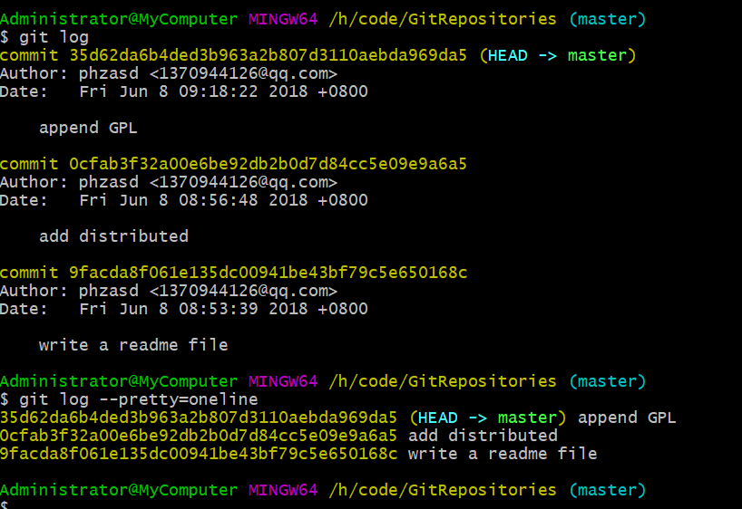

# Git 分布式版本控制工具

## 安装 自行百度 `(*^_^*)`

### Git 使用

#### 创建Git用户
* 因为Git是分布式版本控制系统，所以，每个机器都必须自报家门：你的名字和Email地址。
    >`$ git config --global user.name "Your Name"`
    >`$ git config --global user.email "email@example.com"`
    >注意`git config`命令的`--global`参数，用了这个参数，表示你这台机器上所有的Git仓库都会使用这个配置，当然也可以对某个仓库指定不同的用户名和Email地址

#### 创建版本库
* 版本库又名仓库，英文名repository，你可以简单理解成一个目录，这个目录里面的所有文件都可以被Git管理起来，每个文件的修改、删除，Git都能跟踪，以便任何时刻都可以追踪历史，或者在将来某个时刻可以“还原”。

    > `$ git init`
    >瞬间Git就把仓库建好了，而且告诉你是一个空的仓库（empty Git repository），细心的读者可以发现当前目录下多了一个.git的目录，这个目录是Git来跟踪管理版本库的，没事千万不要手动修改这个目录里面的文件，不然改乱了，就把Git仓库给破坏了。

#### 向版本库中添加文件
* 所有的版本控制系统，其实只能跟踪文本文件的改动，比如TXT文件，网页，所有的程序代码等等。

1. 在版本库中建立文件readme.txt

2. 使用 `git add readme.txt` 可以将文件添加到版本库

3. 使用 `git commit -m "add a txt file radme.txt "` 将文件提交到仓库

#### 版本控制与管理
1. 修改raadme.txt 文件

2. 运行 `git status` 查看仓库当前的状态`

3. 运行 ` git diff readme.txt` 查看修改的内容

4. 运行 `git add` 与 `git commit` 提交修改后的文件

5. 查看版本记录 `git log` 显示从最近到最远的提交日志

6. `git log --pretty=oneline` 可以将一次的修改信息显示到一行中

    >
    >需要友情提示的是，你看到的一大串类似`1094adb...`的是`commit id`（版本号），和SVN不一样，Git的`commit id`不是1，2，3……递增的数字，而是一个SHA1计算出来的一个非常大的数字，用十六进制表示，而且你看到的`commit id`和我的肯定不一样，以你自己的为准。为什么`commit id`需要用这么一大串数字表示呢？因为Git是分布式的版本控制系统，后面我们还要研究多人在同一个版本库里工作，如果大家都用1，2，3……作为版本号，那肯定就冲突了。
    >每提交一个新版本，实际上Git就会把它们自动串成一条时间线。如果使用可视化工具查看Git历史，就可以更清楚地看到提交历史的时间线.
    > 使用Sourcetree 查看时间线
    

7. 版本回退 `$ git reset --hard HEAD^` 
    >Git必须知道当前版本是哪个版本，在Git中，用`HEAD`表示当前版本，也就是最新的提交`1094adb...`（注意我的提交ID和你的肯定不一样），上一个版本就是`HEAD^`，上上一个版本就是`HEAD^^`，当然往上100个版本写100个^比较容易数不过来，所以写成`HEAD~100`
    

8. 回退后返回回退前的版本
    >只要上面的命令行窗口还没有被关掉，你就可以顺着往上找啊找啊，找到那个append GPL的`commit id是1094adb`...，于是就可以指定回到未来的某个版本：
    
    >

9. 现在，你回退到了某个版本，关掉了电脑，第二天早上就后悔了，想恢复到新版本怎么办？找不到新版本的commit id怎么办？

    >在Git中，总是有后悔药可以吃的。当你用`$ git reset --hard HEAD^`回退到add distributed版本时，再想恢复到append GPL，就必须找到append GPL的commit id。Git提供了一个命令`git reflog`用来记录你的每一次命令：
    

10. 版本管理总结

#### 工作区与暂存区
* 工作区（Working Directory）
>就是你在电脑里能看到的目录，比如我的GitRepositories文件夹就是一个工作区

* 版本库（Repository）
    > 工作区有一个隐藏目录`.git`，这个不算工作区，而是Git的版本库。
    Git的版本库里存了很多东西，其中最重要的就是称为`stage`（或者叫index）的暂存区，还有Git为我们自动创建的第一个分支`master`，以及指向`master`的一个指针叫`HEAD`。
    
    > 简单来说就是
    分支和HEAD的概念我们以后再讲。
    前面讲了我们把文件往Git版本库里添加的时候，是分两步执行的：
    第一步是用`git add`把文件添加进去，实际上就是把文件修改添加到暂存区；
    第二步是用`git commit`提交更改，实际上就是把暂存区的所有内容提交到当前分支。
    因为我们创建Git版本库时，Git自动为我们创建了唯一一个`master`分支，所以，现在，`git commi`t就是往`maste`r`分支上提交更改。
    你可以简单理解为，需要提交的文件修改通通放到暂存区，然后，一次性提交暂存区的所有修改。

* `git diff HEAD -- readme.txt`命令可以查看工作区和版本库里面最新版本的区别.

#### 撤销修改
* `git checkout -- fileName` 可以让这个文件回到最近一次`git commi`t或`git add`时的状态。

1. `git checkout -- file`可以丢弃工作区的修改;

2. `$ git reset HEAD file`可以把暂存区的修改撤销掉（unstage），重新放回工作区  

#### 删除文件
1. 使用rm test.txt 后 这时候文件在目录下被删除，恢复办法:`git checkout -- test.txt`

    >git checkout其实是用版本库里的版本替换工作区的版本，无论工作区是修改还是删除，都可以“一键还原”。
    
2. `git rm test.txt` 从本地和版本库中删除文件 `git commit` 之后才会被从版本库中删除
    
    

