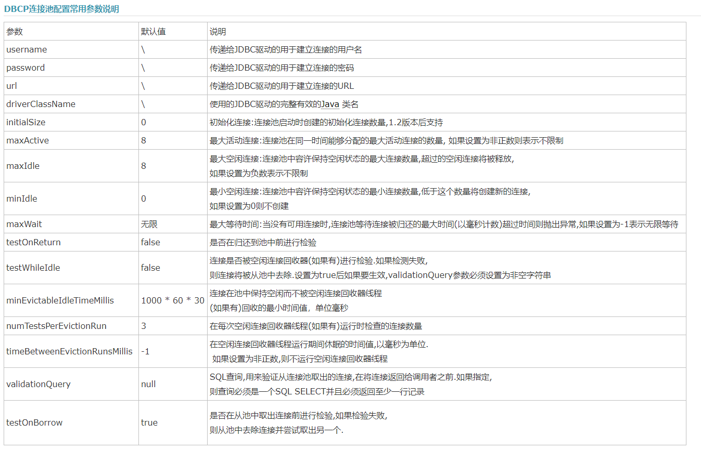

# Apach DBCP 数据库连接池
>&nbsp;&nbsp;实际开发当中，‘获得连接’与‘释放资源’是非常消耗系统资源的两个过程。为了解决这个问题，我们使用连接池技术，来共享Connection，这样我们就不需要每一次都创建连接，释放连接，这些过程都由连接池来做。

## 基本原理
1. 概述
    >用池来管理数据库连接，这样可以重复使用Connection。有了池，我们就不需要自己来创建Connection，而是通过池来获取Connection。当使用完Connection后，调用Connection的close方法，也不会真正的关闭连接，而是把Connection归还给池，这样就可以再次利用这个Connection对象
2. 规范
    >Java 为数据库连接池提供了公共的接口:javax.sql.DataSource,各个厂商需要让自己的连接池实现这个接口,这样应用程序可以方便的切换不同厂商的连接池。常见的连接池DBCP，C3PO。Tomcat内置了一个连接池

## DBCP 连接池
>前提需要引入以下jar包

如果下载的pool包是1.2的版本，还要下载common-collections包：
1. BasicDataSource 类
    >实现了javax.sql.DataSource 接口,以前的url，driver,user,password 等属性都通过set****方法来设置
    

2. 使用连接池后可以再DbUtils的 QueryRunner中传入DataSource，这是不用关闭连接，会自动关闭(可以通过配置文件设置)
