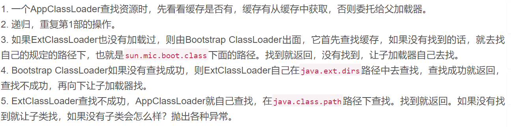

## ClassLoad
>用来将磁盘上的.class字节码文件加载到内存中
>底层实现过程：使用IO流技术，读取字节码文件，获取数据并加载到到内存中

### JAVA 自带的3种字节码加载器
1. BootstrapClassLoader 引导类加载器 不是类 --》是由C/C++语言编写的，一般需要经常使用的八个基本类型+String都是由这个加载的
2. ExtClassLoader 扩展类加载器  类 主要用来加载Ext包下的类
3. AppClassLoader 应用类加载器 加载我们自定义的类

###  类的加载过程
>双亲委托。 
一个类加载器查找class和resource时，是通过“委托模式”进行的，它首先判断这个class是不是已经加载成功，如果没有的话它并不是自己进行查找，而是先通过父加载器，然后递归下去，直到Bootstrap ClassLoader，如果Bootstrap classloader找到了，直接返回，如果没有找到，则一级一级返回，最后到达自身去查找这些对象。这种机制就叫做双亲委托。 

### 类加载中几个重要的方法
1. loadClass()
2. findLoadedClass()
3. findClass()
4. defineClass()
* 执行过程
    >进入loadClass 
    >1. 执行findLoadedClass(String)去检测这个class是不是已经加载过了。 
    >2. 执行父加载器的loadClass方法。如果父加载器为null，则jvm内置的加载器去替代，也就是Bootstrap ClassLoader。这也解释了ExtClassLoader的parent为null,但仍然说Bootstrap ClassLoader是它的父加载器。 
   > 3. 如果向上委托父加载器没有加载成功，则通过findClass(String)查找。
   >4. 如果class在上面的步骤中找到了，参数resolve又是true的话，那么loadClass()又会调用resolveClass(Class)这个方法生成最终的Class对象。
    >5. defineClass 将根据类名，类的二进制数据，返回一个类的实例对象
### 自定义ClassLoader
>要注意的是如果要编写一个classLoader的子类，也就是自定义一个classloader，建议覆盖findClass()方法，而不要直接改写loadClass()方法。 
