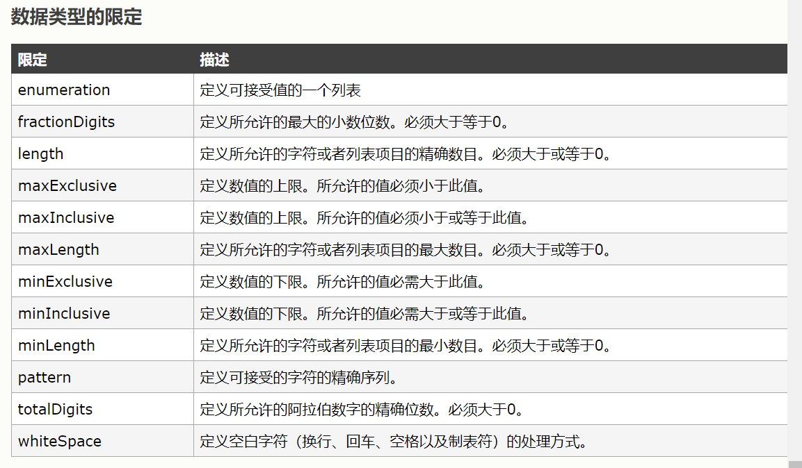

# XML(eXtensible makeup language)
***************
## XML有什么用？
1. 可以用来保存数据
2. 可以用来做配置文件
3. 数据传输载体

## XML的简单声明
```XML
<?xml version="1.0" encoding="utf-8" ?>
<stus>
    <!--注释-->
    <stu id='1'>
        <name>张三</name>
        <age>34</age>
    </stu>
    <stu id='2'>
        <name>张三</name>
        <age>34</age>
        <dest><![CDATA[<a>link</a>]]></dest>
    </stu>
</stus>
```
## CDATA区
>如果某段字符串中有过多的字符,并且包含了类似标签的文字，想让XML解析器去解析，可以使用CDATA来包装,CDATA语法格式见上面的示例

## XML约束
>XML中都是自定义的标签,若出现一个小小的错误，则软件程序将不能正确的解析，因此可以编写一个文档来约束一个XML的书写规范。
### 常见的约束
1. DTD约束
    ```
    1.引入dtd文件
        1.在XML文档中直接书写DTD约束
            <!DOCTYP 书架 [
                !ELEMENT 书 (书名,作者,售价,简介)><!--按顺序出现的子节点-->
                <!ELEMENT 书名 (#PCDATA)>
                <!ELEMENT 作者 (#PCDATA)>
                <!ELEMENT 售价 (#PCDATA)>
                <!ELEMENT 简介 (#PCDATA)>
            ]>
        2.引入本地dtd文件
            <!DOCTYP 根节点 SYSTEM "dtd文件的地址">
        3.引入网络上的DTD文件
            <!DOCTYP 根节点 PUBLIC "DTD文件名称" "DTD文件的地址">
    2.语法
        1.元素定义
            <!ELEMENT 元素名 使用规则>
                1. (#PCDATA)  字符串
                2. EMPTY      空 (空标签,如<br/> <aa></aa>  
                3. ANY        任意的
                4. (子元素)
                    子元素之间的关系:
                        1. , 表示子元素是按顺序出现的
                        2. | 表示子元素只能出现一个
                    子元素出现的次数
                        1. + 元素出现一次或多次
                        2. * 元素出现0次或多次
                        3. ? 元素出现0次或1次
        2.属性定义
            <!ATTLIST 元素名称 
                属性名称 属性类型 属性约束
                属性名称 属性类型 属性约束
                属性名称 属性类型 属性约束
            >
                1.属性类型 
                    CDATA 普通字符串
                    (男人|女人)      枚举
                    ID 表示唯一的值 不能只写数字
                2.属性的约束
                    #REQUIRED 必须出现的
                    #IMPLIED  可选的(可有可无)
                    #FIXED    固定值 #FIXED "aa"
                    默认值 不使用
        3.实体定义
            <!ENTITY 别名  "值">
            引用 &别名;
	//示例
	<?xml version="1.0" encoding="utf-8" ?>
    <!ELEMENT 书架 (书+)>
	<!ELEMENT 书 (书名,作者,售价,简介)><!--按顺序出现的子节点-->
	<!ELEMENT 书名 (#PCDATA)>
	<!ELEMENT 作者 (#PCDATA)>
	<!ELEMENT 售价 (#PCDATA)>
	<!ELEMENT 简介 (#PCDATA)>
	<!ATTLIST 书 
		出版社  CDATA #REQUIRED
		类别 (武侠|历史) #REQUIRED
		编号 ID #REQUIRED
		ID  CDATA #REQUIRED
		出版日期 CDATA #FIXED "2014-1-1"
		
	>

	<!ENTITY bookname "kkk"
    ```
2. schema
	其出现是为了克服DTD的缺陷性
	1. 与DTD的区别:
		+ XML Schema 符合XML的语法结构
		+ DOM和SAX API 都可以很容易的解析出XML Schema中的内容
		+ XML Schema对名称空间支持的非常好
		+ XML Schema 比DTD支持更多的数据类型，并支持用户自定义的数据类型
		+ XML Schema 定义约束的能力十分强大，可以对XML实列文档做出细致的语义限制
		+ XMLSchema 不能像DTD一样定义实体,比DTD更复杂,Schema现在已是w3c的标准，正在逐步取代DTD
    2. 基本概念
        * XML Schema 后缀名是.xsd
        * XML 本身就是符合XML语法结构
        * XML Schema 只有一个根节点Schema
        * 需要引入w3c的名称空间
        ```xsd
        <?xml version="1.0" encoding="UTF-8"?>
        <schema xmlns="http://www.w3.org/2001/XMLSchema" targetNamespace="http://www.example.org/book" xmlns:tns="http://www.example.org/book" elementFormDefault="qualified">

        </schema>
        ```
        + xmlns:表示Schema的命名空间
        + targetNameSpace:元素用于指定Schema文档中声明的元素属于那个名称空间
        xmlns:tns: 引入时要写的名称空间
        + elementFormDefault元素用于指定，该Schema文档中声明的根元素以及所有子元素都属于targetNameSpace所指定的名称空间。
    3. 语法
        * 定义元素
            1. 简单元素
                * <xs:element name="书名" type="string"></xs:element>
                    * 常用类型:
                        * xs:string
                        * xs:decimal
                        * xs:integer
                        * xs:boolean
                        * xs:date
                        * xs:time
                    * 默认值:
                        * <xs:element name="color" type="xs:string" default="red"/>
                    * 固定值:
                        * <xs:element name="color" type="xs:string" default="red"/>
            2. 复杂元素
                1. 先声明标签是复杂的:
                     <xs:complexType>
                2. 子元素之间的关系:
                    maxOccurs：定义子节点出现的最大次数 默认为1，设置为unbounded表示不限制
                    minOccurs:定义子节点出现的最小次数 默认为1

                    <xs:sequence> 全有 有顺序的
                    <xs:choice> 或，出现一个
                    <xs:all>  必须都有，顺序不定
                    <xs:attribute>  定义属性
            3. 限定:
                1. 对值的限定
                    <xs:element name="age">
                        <xs:simpleType>
                            <xs:restriction base="xs:integer">
                                <xs:minInclusive value="0"/>
                                <xs:maxInclusive value="120"/>
                            </xs:restriction>
                        </xs:simpleType>
                    </xs:element> 
                2. 对一组值的限定
                    <xs:element name="car">
                        <xs:simpleType>
                            <xs:restriction base="xs:string">
                                <xs:enumeration value="Audi"/>
                                <xs:enumeration value="Golf"/>
                                <xs:enumeration value="BMW"/>
                            </xs:restriction>
                        </xs:simpleType>
                    </xs:element> 
                3. 对一系列值的限定 正则表达式
                    <xs:element name="letter">
                        <xs:simpleType>
                            <xs:restriction base="xs:string">
                                <xs:pattern value="[a-z]"/>
                            </xs:restriction>
                        </xs:simpleType>
                    </xs:element> 
                4. 对长度的限定
                    <xs:element name="password">
                        <xs:simpleType>
                            <xs:restriction base="xs:string">
                             <xs:length value="8"/>
                            </xs:restriction>
                        </xs:simpleType>
                    </xs:element> 
                5. 常用的限定
                
            3. 起名
                1. targetNameSpace:元素用于指定Schema文档中声明的元素属于那个名称空间，值可以是任意的 http://www.ph.com/110
            4. elementFormDefault:元素用于指定，该Schema文档中声明的根元素以及所有子元素都属于targetNameSpace所指定的名称空间。
                1. qualified(通常使用这个)
                2. unqualified
        * 定义Attribute
            1. <xs:attribute name="lang" type="xs:string" />
            2. 其他属性值:
                1. 固定值<xs:attribute name="lang" type="xs:string" fixed="EN"/>、
                2. 默认值<xs:attribute name="lang" type="xs:string" default="EN"/>
                3. 可选或者必须
                    在缺省的情况下，属性是可选的。如需规定属性为必选，请使用 "use" 属性
                    <xs:attribute name="lang" type="xs:string" use="required"/>

    4. 引入
        1. 引入w3c的命名空间
            xmlns:xsi="http://www.w3.org/2001/XMLSchema-instance"
        2. 引入自己编写的Schema文档
            xmlns="http://www.ph.com/book"
        3. 问题 元素上不能有相同的属性名称
            通过起别名的方法解决
            技巧:在标签出现概率小的命名空间上起别名
        4. 引入schemaLocation
            xsi:schemaLocation="名称空间  地址"  
    5. 示例
    ```xml
    <?xml version="1.0" encoding="UTF-8"?>
    <schema xmlns="http://www.w3.org/2001/XMLSchema" targetNamespace="http://www.ph.com/book" elementFormDefault="qualified">
        <!-- 复杂元素 -->
        <element name="书架">
            <complexType>
                <!-- 有顺序的 -->
                <sequence maxOccurs="unbounded">
                    <element name="书">
                        <complexType>
                            <sequence>
                                <!-- 简单元素 -->
                                <element name="书名" type="string"></element>
                                <element name="作者" type="string"></element>
                                <element name="售价" type="double"></element>
                                <element name="简介" type="string"></element>
                            </sequence>
                            <attribute name="出版社" type="string" use="required"></attribute>
                            <attribute name="类别"  use="required">
                                <simpleType>
                                    <restriction base="string">
                                        <enumeration value="武侠"/>
                                        <enumeration value="玄幻"/>									
                                    </restriction>
                                </simpleType>
                            </attribute>
                            <attribute name="编号" type="ID" use="required"></attribute>
                            <attribute name="ID" type="string" use="required"></attribute>
                            <attribute name="出版日期" type="string"></attribute>
                        </complexType>
                    </element>
                </sequence>
            </complexType>
        </element>
    </schema>
    ```

	

