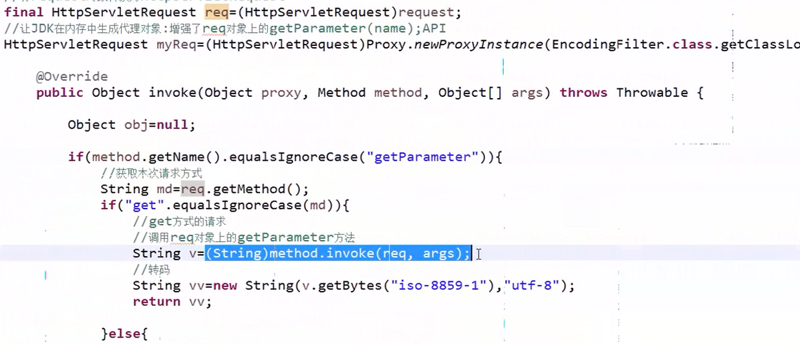

## 动态代理

### 动态代理模式主要由四个元素共同构成：

1. 接口，接口中的方法是要真正去实现的

2. 被代理类，实现上述接口，这是真正去执行接口中方法的类

3. 代理类，实现InvocationHandler,帮助被代理类去实现方法

```java
public interface ICar
{
	void start();
	void stop();
}


public class GoogleCar implements ICar
{

	@Override
	public void start()
	{
		System.out.println("start");
	}

	@Override
	public void stop()
	{
		System.out.println("stop");
	}

}


public class CarInvocationHandler implements InvocationHandler
{
	private Object obj;//代理的对象

	public CarInvocationHandler(Object obj)
	{
		super();
		this.obj = obj;
	}

	@Override
	public Object invoke(Object proxy, Method method, Object[] args) throws Throwable
	{
		if(method.getName().equals("start"))
		{
			System.out.println("检查天气是否良好");
			method.invoke(obj, args);
			System.out.println("检查天气是否良好");
		}
		else
		{
			method.invoke(obj, args);
		}
		
		return null;
	}

}


public class CarMain
{
	public static void main(String[] args)
	{
		ICar car = (ICar)Proxy.newProxyInstance(CarMain.class.getClassLoader(), GoogleCar.class.getInterfaces(),new CarInvocationHandler(new GoogleCar()));
		car.start();
		car.stop();
	}
}

```
