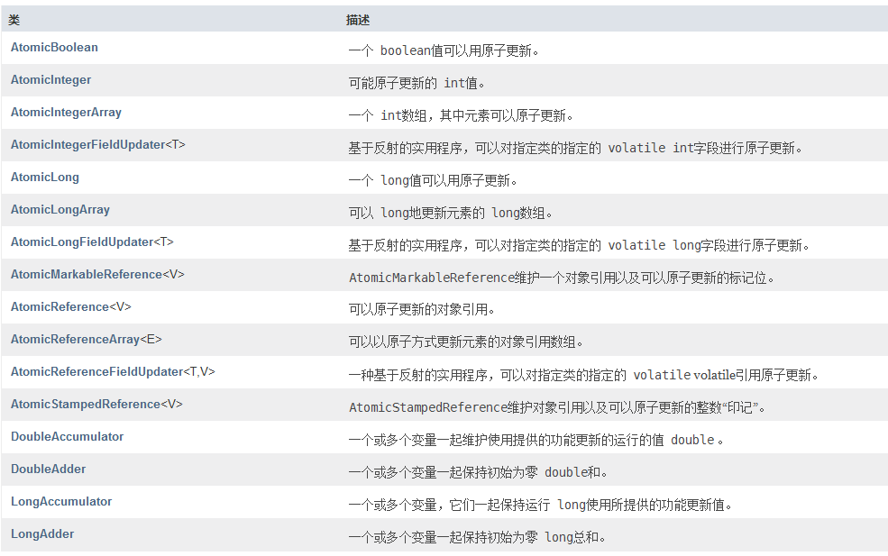

# Java5的 线程并发库
## java.util.concurrent.atomic
>一个小型工具包，支持单个变量上的无锁线程安全编程.
>包含的类:

这些类都是与原子性的操作

## java.util.concurrent
1. 线程池
    ```java
    //线程池的创建
    //创建一个线程池，该线程池重用固定数量的从共享无界队列中运行的线程。 
    //在任何时候，最多nThreads线程将处于主动处理任务。 
    //如果所有线程处于活动状态时都会提交其他任务，则它们将等待队列中直到线程可用。 
    //如果任何线程由于在关闭之前的执行期间发生故障而终止，则如果需要执行后续任务，则新线程将占用它。 
    //池中的线程将存在，直到它明确地为shutdown 。
    //public static ExecutorService newFixedThreadPool(int nThreads)
    ExecutorService es = Executors.newFixedThreadPool(3);

    //向线程池中添加任务
    es.execute(new Runnable(){});//可以添加多个任务
    //但是最多有三个线程去执行这些任务,即最多只有三个任务同时执行

    //线程池的关闭
    es.shutdown();//所有任务执行完后关闭
    es.shutdownNow(); //立即关闭，不管任务有没有执行完

    //创建缓存的线程池
    //创建一个根据需要创建新线程的线程池，但在可用时将重新使用以前构造的线程。 
    //这些池通常会提高执行许多短暂异步任务的程序的性能。 
    //调用execute将重用以前构造的线程（如果可用）。 
    //如果没有可用的线程，将创建一个新的线程并将其添加到该池中。 
    //未使用六十秒的线程将被终止并从缓存中删除。 
    //因此，长时间保持闲置的池将不会消耗任何资源
    public static ExecutorService newCachedThreadPool()

    //创建只有单个线程的线程池

    public static ExecutorService newSingleThreadExecutor() 

    //如何实现线程死掉后重新启动，通过单一线程池，这样这个线程死掉后，线程池会自动重新创建一个线程来替代

    //调度线程池
	ScheduledExecutorService se = Executors.newScheduledThreadPool(3);
	se.schedule(new Runnable() //10秒后执行
	{	
		@Override
		public void run()
		{
			System.out.println("bombing");
		}
	}, 3, TimeUnit.SECONDS);
		
	se.scheduleAtFixedRate(new Runnable()//6秒后第一次执行，以后每隔两秒执行一次
	{
			
		@Override
		public void run()
		{
			System.out.println("bombing");
		}
	}, 6, 2, TimeUnit.SECONDS);
		
	se.scheduleWithFixedDelay(new Runnable()
	{
			
		@Override
		public void run()
		{
			System.out.println("bombing");
		}
	}, 3, 2, TimeUnit.SECONDS);

    ```
## Callable 与 Future 类似 dot net 的async与await
>使用Callable来执行任务，Future获取结果，在使用到结果的时候如果Callable还没结束，程序会暂停并等待结果，就跟await一样
```java
public class CallableAndFuture
{
	/**
	 * @param args
	 */
	public static void main(String[] args)
	{
		ExecutorService es = Executors.newSingleThreadExecutor();
		Future<String> future = es.submit(new Callable<String>()
		{
			@Override
			public String call() throws Exception
			{
				Thread.sleep(2000);
				return "Hello";
			}
		});
		
		System.out.println("等待结果");
		try
		{
			System.out.println("返回结果:"+future.get());
		}
		catch (InterruptedException e)
		{
			e.printStackTrace();
		}
		catch (ExecutionException e)
		{
			e.printStackTrace();
		}
		
		es.shutdown();
		
		ExecutorService es1 = Executors.newFixedThreadPool(10);
		CompletionService<Integer> completionService = new ExecutorCompletionService<>(es1);
		
		for(int i=1;i<=10;i++)
		{
			final int sequence=i;
			completionService.submit(new Callable<Integer>()
			{

				@Override
				public Integer call() throws Exception
				{
					Thread.sleep(new Random().nextInt(5000));
					return sequence;
				}
			});
		}
		
		for(int i=0;i<10;i++)
		{
			try
			{
				System.out.println(completionService.take().get());
			}
			catch (InterruptedException | ExecutionException e)
			{
				e.printStackTrace();
			}
		}
		
		
		es1.shutdown();
	}
}
```
## java.util.concurrent.locks
>主要的类与接口

```java
//Lock接口
void lock() //获得锁。  
void lockInterruptibly() //获取锁定，除非当前线程是 interrupted 。 
Condition newCondition() //返回一个新Condition绑定到该实例Lock实例。
boolean tryLock() //只有在调用时才可以获得锁。  
boolean tryLock(long time, TimeUnit unit) //如果在给定的等待时间内是空闲的，并且当前的线程尚未得到 interrupted，则获取该锁。  
void unlock() //释放锁。 
//使用规范
//当在不同范围内发生锁定和解锁时，
//必须注意确保在锁定时执行的所有代码由try-finally或try-catch保护，以确保在必要时释放锁定。
Lock l = ...; l.lock(); try { } finally { l.unlock(); } 

//ReentrantLock
static class Outputer
{
	Lock lock = new ReentrantLock();
		
	public void output(String name)
	{
		lock.lock();
		try
		{
			int len=name.length();
			for(int i=0;i<len;i++)
			{
				System.out.print(name.charAt(i));
			}
			System.out.println();
		}
		finally
		{
			// TODO: handle finally clause
			lock.unlock();
		}
	}
		
} 

//基于读写锁的缓存
public class CacheDemo
{
	private Map<String, Object> cache = new HashMap<>();
	private ReentrantReadWriteLock rwl = new ReentrantReadWriteLock();
	public static void main(String[] args)
	{
		
	}
	//这种思路不能很好的处理获取数据
	//因为所有的获取数据都是互斥的，效率低
	public synchronized Object getData1(String key)
	{
		Object value = cache.get(key);
		if(value==null)
		{
			value=new Random().nextInt(100);
			cache.put(key, value);
		}
		return value;
	}
	
	//锁降级：从写锁变成读锁；
	//锁升级：从读锁变成写锁。
	//读锁是可以被多线程共享的，写锁是单线程独占的。
	//也就是说写锁的并发限制比读锁高，这可能就是升级/降级名称的来源。
	/**
	 * 这栋方法使用读写锁来搞定缓存，同时读的时候不互斥，
	 *当有一个去修改的时候，转换为写锁
	 * @param key
	 * @return value
	 */
	public Object getData2(String key)
	{
		rwl.readLock().lock();
		Object value = null;
		try
		{
			value=cache.get(key);
			if(value==null)//缓存中没有数据，去获取
			{
				rwl.readLock().unlock();//释放读锁
				rwl.writeLock().lock();	//加写锁
				try
				{
					value=cache.get(key);//为了防止多次写入
					if(value==null)//为了防止多次写入
					{
						value=new Random().nextInt(100);
						cache.put(key, value);
					}
					rwl.readLock().lock();
				}
				finally
				{
					// TODO: handle finally clause
					rwl.writeLock().unlock();
				}
				
			}
		}
		finally 
		{
			rwl.readLock().unlock();
		}
		
		return value;
	}
}

/*
	关于读写锁升级和降级的限制
	1.因为同一个线程中，在没有释放读锁的情况下，就去申请写锁，这属于锁升级，ReentrantReadWriteLock是不支持的。
	2.从写锁降级成读锁，并不会自动释放当前线程获取的写锁，仍然需要显示的释放，否则别的线程永远也获取不到写锁。
*/
```
## Condition 线程通信
```java
	//利用condition进行线程间的通信
	static class Business
	{
		private ReentrantLock lock = new ReentrantLock();
		private Condition condition1 = lock.newCondition();
		private Condition condition2 = lock.newCondition();
		private Condition condition3 = lock.newCondition();
		private int flag=1;
		public void sub(int i)
		{
			lock.lock();
			try
			{
				while(flag!=1)
				{
					try
					{
						//this.wait();
						condition1.await();
					}
					catch (InterruptedException e)
					{
						e.printStackTrace();
					}
				}
				for (int j = 1; j <= 10; j++)
				{
					System.out.println("sub thread sequence of " + j+",loop of "+i);
				}
				flag=2;
				condition2.signal();
			}
			finally
			{
				// TODO: handle finally clause
				lock.unlock();
			}
		}
		
		public void sub2(int i)
		{
			lock.lock();
			try
			{
				while(flag!=2)
				{
					try
					{
						//this.wait();
						condition2.await();
					}
					catch (InterruptedException e)
					{
						e.printStackTrace();
					}
				}
				for (int j = 1; j <= 20; j++)
				{
					System.out.println("sub2 thread sequence of " + j+",loop of "+i);
				}
				flag=3;
				condition3.signal();
			}
			finally
			{
				// TODO: handle finally clause
				lock.unlock();
			}
		}
		
		public void main(int i)
		{
			lock.lock();
			try
			{
				while(flag!=3)
				{
					try
					{
						//this.wait();
						condition3.await();
					}
					catch (InterruptedException e)
					{
						e.printStackTrace();
					}
				}
				for (int j = 1; j <= 100; j++)
				{
					System.out.println("main thread sequence of " + j+",loop of "+i);
				}
				flag=1;
				//this.notify();
				condition1.signal();
			}
			finally
			{
				// TODO: handle finally clause
				lock.unlock();
			}
			
		}
	}
```

