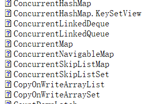

## Semaphore 简介
>Semaphore 可以维护当前访问自身的线程个数，并提供了同步机制。
```javva
package com.ph.timertest;

import java.util.concurrent.Semaphore;
import java.util.concurrent.locks.ReentrantLock;

public class SemaphoreAndLockTest implements Runnable
{
	private ResourceManage resourceManage;
	private int userId;

	public SemaphoreAndLockTest(ResourceManage resourceManage, int userId)
	{
		this.resourceManage = resourceManage;
		this.userId = userId;
	}

	public void run()
	{
		System.out.print("userId:" + userId + "准备使用资源...\n");
		resourceManage.useResource(userId);
		System.out.print("userId:" + userId + "使用资源完毕...\n");
	}

	public static void main(String[] args)
	{
		ResourceManage resourceManage = new ResourceManage();
		;
		for (int i = 0; i < 100; i++)
		{
			new Thread(new SemaphoreAndLockTest(resourceManage, i)).start();;// 创建多个资源使用者
		}
	}
}

class ResourceManage
{
	private final Semaphore semaphore;
	private boolean resourceArray[];
	private final ReentrantLock lock;

	public ResourceManage()
	{
		this.resourceArray = new boolean[10];// 存放厕所状态
		this.semaphore = new Semaphore(10, true);// 控制10个共享资源的使用，使用先进先出的公平模式进行共享;公平模式的信号量，先来的先获得信号量
		this.lock = new ReentrantLock(true);// 公平模式的锁，先来的先选
		for (int i = 0; i < 10; i++)
		{
			resourceArray[i] = true;// 初始化为资源可用的情况
		}
	}

	public void useResource(int userId)
	{
		try
		{
			semaphore.acquire();
		}
		catch (InterruptedException e1)
		{
			e1.printStackTrace();
		}
		
		try
		{
			int id = getResourceId();// 占到一个坑
			System.out.print("userId:" + userId + "正在使用资源，资源id:" + id + "\n");
			Thread.sleep(100);// do something，相当于于使用资源
			resourceArray[id] = true;// 退出这个坑
		}
		catch (InterruptedException e)
		{
			e.printStackTrace();
		}
		finally
		{
			semaphore.release();// 释放信号量，计数器加1
		}
	}

	private int getResourceId()
	{
		int id = -1;
		lock.lock();
		try
		{
			for (int i = 0; i < 10; i++)
			{
				if (resourceArray[i])
				{
					resourceArray[i] = false;
					id = i;
					break;
				}
			}
		}
		catch (Exception e)
		{
			e.printStackTrace();
		}
		finally
		{
			lock.unlock();
		}
		return id;
	}
}

```
## CyclicBarrier 同步工具
>允许一组线程全部等待彼此达到共同屏障点的同步辅助。 循环阻塞在涉及固定大小的线程方的程序中很有用，这些线程必须偶尔等待彼此。 屏障被称为循环 ，因为它可以在等待的线程被释放之后重新使用。 
一个 CyclicBarrier支持一个可选的Runnable命令，每个屏障点运行一次，在派对中的最后一个线程到达之后，但在任何线程释放之前。 在任何一方继续进行之前，此屏障操作对更新共享状态很有用。 
```java
//常用方法
//在所有参与者都已经在此 barrier 上调用 await 方法之前，将一直等待。
int await()  

//在所有参与者都已经在此屏障上调用 await 方法之前将一直等待,或者超出了指定的等待时间。
int await(long timeout, TimeUnit unit) 

//返回当前在屏障处等待的参与者数目。          
int getNumberWaiting() 

//返回要求启动此 barrier 的参与者数目。        
int getParties() 

//查询此屏障是否处于损坏状态。          
boolean isBroken() 

//将屏障重置为其初始状态。            
void reset() 
          
//示例
package com.ph.timertest;

import java.util.concurrent.CyclicBarrier;
import java.util.concurrent.ExecutorService;
import java.util.concurrent.Executors;

public class CyclicBarrierTest
{

	public static void main(String[] args)
	{
		ExecutorService service = Executors.newCachedThreadPool();
		final CyclicBarrier cb = new CyclicBarrier(3);
		for (int i = 0; i < 3; i++)
		{
			Runnable runnable = new Runnable()
			{
				public void run()
				{
					try
					{
						Thread.sleep((long) (Math.random() * 10000));
						System.out.println(
								"线程" + Thread.currentThread().getName() + "即将到达集合地点1，当前已有" + (cb.getNumberWaiting() + 1)
										+ "个已经到达，" + (cb.getNumberWaiting() == 2 ? "都到齐了，继续走啊" : "正在等候"));
						cb.await();

						Thread.sleep((long) (Math.random() * 10000));
						System.out.println(
								"线程" + Thread.currentThread().getName() + "即将到达集合地点2，当前已有" + (cb.getNumberWaiting() + 1)
										+ "个已经到达，" + (cb.getNumberWaiting() == 2 ? "都到齐了，继续走啊" : "正在等候"));
						cb.await();
						Thread.sleep((long) (Math.random() * 10000));
						System.out.println(
								"线程" + Thread.currentThread().getName() + "即将到达集合地点3，当前已有" + (cb.getNumberWaiting() + 1)
										+ "个已经到达，" + (cb.getNumberWaiting() == 2 ? "都到齐了，继续走啊" : "正在等候"));
						cb.await();
					}
					catch (Exception e)
					{
						e.printStackTrace();
					}
				}
			};
			service.execute(runnable);
		}
		service.shutdown();
	}
}

```
## CountDownLatch 
>允许一个或多个线程等待直到在其他线程中执行的一组操作完成的同步辅助。
>A CountDownLatch用给定的计数初始化。 await方法阻塞，直到由于countDown()方法的调用而导致当前计数达到零，之后所有等待线程被释放，并且任何后续的await 调用立即返回。 这是一个一次性的现象 - 计数无法重置。 如果您需要重置计数的版本，请考虑使用CyclicBarrier 。 

```java
package com.ph.timertest;

import java.util.concurrent.CountDownLatch;
import java.util.concurrent.ExecutorService;
import java.util.concurrent.Executors;

public class CountdownLatchTest
{

	public static void main(String[] args)
	{
		ExecutorService service = Executors.newCachedThreadPool();
		final CountDownLatch cdOrder = new CountDownLatch(1);
		final CountDownLatch cdAnswer = new CountDownLatch(3);
		for (int i = 0; i < 3; i++)
		{
			Runnable runnable = new Runnable()
			{
				public void run()
				{
					try
					{
						System.out.println("线程" + Thread.currentThread().getName() + "正准备接受命令");
						cdOrder.await();
						System.out.println("线程" + Thread.currentThread().getName() + "已接受命令");
						Thread.sleep((long) (Math.random() * 10000));
						System.out.println("线程" + Thread.currentThread().getName() + "回应命令处理结果");
						cdAnswer.countDown();
					}
					catch (Exception e)
					{
						e.printStackTrace();
					}
				}
			};
			service.execute(runnable);
		}
		try
		{
			Thread.sleep((long) (Math.random() * 10000));

			System.out.println("线程" + Thread.currentThread().getName() + "即将发布命令");
			cdOrder.countDown();
			System.out.println("线程" + Thread.currentThread().getName() + "已发送命令，正在等待结果");
			cdAnswer.await();
			System.out.println("线程" + Thread.currentThread().getName() + "已收到所有响应结果");
		}
		catch (Exception e)
		{
			e.printStackTrace();
		}
		service.shutdown();

	}
}

```
## Exchanger
>线程可以在成对内配对和交换元素的同步点。 每个线程在输入exchange方法时提供一些对象，与合作者线程匹配，并在返回时接收其合作伙伴的对象。 交换器可以被视为一个的双向形式SynchronousQueue 。 交换器在诸如遗传算法和管道设计的应用中可能是有用的。 
```java
package com.ph.timertest;

import java.util.concurrent.Exchanger;
import java.util.concurrent.ExecutorService;
import java.util.concurrent.Executors;

public class ExchangerTest
{

	public static void main(String[] args)
	{
		ExecutorService service = Executors.newCachedThreadPool();
		final Exchanger<String> exchanger = new Exchanger<>();
		service.execute(new Runnable()
		{
			public void run()
			{
				try
				{

					String data1 = "zxx";
					System.out.println("线程" + Thread.currentThread().getName() + "正在把数据" + data1 + "换出去");
					Thread.sleep((long) (Math.random() * 10000));
					String data2 = exchanger.exchange(data1);
					System.out.println("线程" + Thread.currentThread().getName() + "换回的数据为" + data2);
				}
				catch (Exception e)
				{

				}
			}
		});
		service.execute(new Runnable()
		{
			public void run()
			{
				try
				{

					String data1 = "lhm";
					System.out.println("线程" + Thread.currentThread().getName() + "正在把数据" + data1 + "换出去");
					Thread.sleep((long) (Math.random() * 10000));
					String data2 = exchanger.exchange(data1);
					System.out.println("线程" + Thread.currentThread().getName() + "换回的数据为" + data2);
				}
				catch (Exception e)
				{

				}
			}
		});
	}
}
```
## 可阻塞队列 BlockingQueue<E> 接口
>已知实现类
>ArrayBlockingQueue ， 
 DelayQueue ， 
 LinkedBlockingDeque ，
 LinkedBlockingQueue ， 
 LinkedTransferQueue ， 
 PriorityBlockingQueue ， 
 SynchronousQueue
 对于阻塞队列来说只有put方法和take方法才具有阻塞功能
 ```java
 package com.ph.timertest;

import java.util.concurrent.ArrayBlockingQueue;
import java.util.concurrent.BlockingQueue;

public class BlockingQueueTest
{
	public static void main(String[] args)
	{
		final BlockingQueue<Integer> queue = new ArrayBlockingQueue<>(3);
		for (int i = 0; i < 2; i++)
		{
			new Thread()
			{
				public void run()
				{
					while (true)
					{
						try
						{
							Thread.sleep((long) (Math.random() * 1000));
							System.out.println(Thread.currentThread().getName() + "准备放数据!");
							queue.put(1);
							System.out.println(
									Thread.currentThread().getName() + "已经放了数据，" + "队列目前有" + queue.size() + "个数据");
						}
						catch (InterruptedException e)
						{
							e.printStackTrace();
						}

					}
				}

			}.start();
		}

		new Thread()
		{
			public void run()
			{
				while (true)
				{
					try
					{
						Thread.sleep(1000);
						System.out.println(Thread.currentThread().getName() + "准备去数据!");
						queue.take();
						System.out.println(Thread.currentThread().getName() + "已取走数据" + "队列目前有" + queue.size() + "个数据");
					}
					catch (InterruptedException e)
					{
						e.printStackTrace();
					}
				}
			}

		}.start();
	}
}

 ```
 ## 阻塞队列的通信
```java
package com.ph.timertest;

import java.util.Collections;
import java.util.concurrent.ArrayBlockingQueue;
import java.util.concurrent.BlockingQueue;

public class BlockingQueueCommunication
{

	/**
	 * @param args
	 */
	public static void main(String[] args)
	{

		final Business business = new Business();
		new Thread(new Runnable()
		{

			@Override
			public void run()
			{

				for (int i = 1; i <= 50; i++)
				{
					business.sub(i);
				}

			}
		}).start();

		for (int i = 1; i <= 50; i++)
		{
			business.main(i);
		}

	}

	static class Business
	{

		BlockingQueue<Integer> queue1 = new ArrayBlockingQueue<Integer>(1);
		BlockingQueue<Integer> queue2 = new ArrayBlockingQueue<Integer>(1);

		{
			try
			{
				queue2.put(1);
			}
			catch (InterruptedException e)
			{
				// TODO Auto-generated catch block
				e.printStackTrace();
			}
		}

		public void sub(int i)
		{
			try
			{
				queue1.put(1);
			}
			catch (InterruptedException e)
			{
				// TODO Auto-generated catch block
				e.printStackTrace();
			}
			for (int j = 1; j <= 10; j++)
			{
				System.out.println("sub thread sequece of " + j + ",loop of " + i);
			}
			try
			{
				queue2.take();
			}
			catch (InterruptedException e)
			{
				// TODO Auto-generated catch block
				e.printStackTrace();
			}
		}

		public void main(int i)
		{
			try
			{
				queue2.put(1);
			}
			catch (InterruptedException e1)
			{
				// TODO Auto-generated catch block
				e1.printStackTrace();
			}
			for (int j = 1; j <= 100; j++)
			{
				System.out.println("main thread sequece of " + j + ",loop of " + i);
			}
			try
			{
				queue1.take();
			}
			catch (InterruptedException e)
			{
				// TODO Auto-generated catch block
				e.printStackTrace();
			}
		}
	}

}

```
## 并发集合

```java
package com.ph.timertest;

import java.util.Collection;
import java.util.Iterator;
import java.util.concurrent.CopyOnWriteArrayList;

public class CollectionModifyExceptionTest
{
	public static void main(String[] args)
	{
		Collection<User> users = new CopyOnWriteArrayList<>();

		// new ArrayList();
		users.add(new User("张三", 28));
		users.add(new User("李四", 25));
		users.add(new User("王五", 31));

		Iterator<User> itrUsers = users.iterator();
		
		while (itrUsers.hasNext())
		{
			System.out.println("aaaa");
			User user =  itrUsers.next();
			if ("李四".equals(user.getName()))
			{
				users.remove(user);
				// itrUsers.remove();
			}
			else
			{
				System.out.println(user);
			}
		}
	}
}

```
