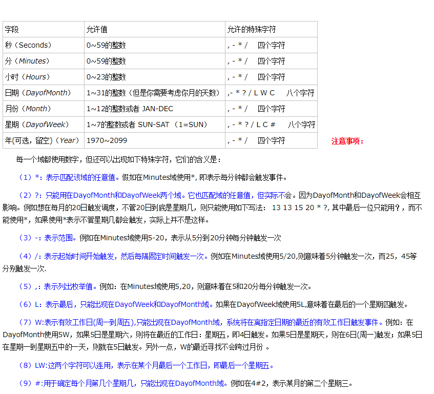

# 传统的定时器
## 定义
    ```java
    //定时器调度 10秒钟后执行一次
   new Timer().schedule(new TimerTask()
	{
			
		@Override
		public void run()
		{
			System.out.println("Hello World");
		}
	}, 10000);
		
	while(true)
	{
		System.out.println(Calendar.getInstance().get(Calendar.SECOND));
		try
		{
			Thread.sleep(1000);
		}
		catch (Exception e)
		{
			// TODO: handle exception
		}
	}

    //Timer类的其他方法
    //终止此计时器，丢弃所有当前已安排的任务。
    void cancel()

    从此计时器的任务队列中移除所有已取消的任务。
    int purge() 

    安排在指定的时间执行指定的任务。
    void schedule(TimerTask task, Date time)

    安排指定的任务在指定的时间开始进行重复的固定延迟执行。
    void schedule(TimerTask task, Date firstTime, long period)

    安排在指定延迟后执行指定的任务。
    void schedule(TimerTask task, long delay)  

    安排指定的任务从指定的延迟后开始进行重复的固定延迟执行。    
    void schedule(TimerTask task, long delay, long period)

    安排指定的任务在指定的时间开始进行重复的固定速率执行。
    void scheduleAtFixedRate(TimerTask task, Date firstTime, long period)

    安排指定的任务在指定的延迟后开始进行重复的固定速率执行。
    void scheduleAtFixedRate(TimerTask task, long delay, long period)
    ```

### 用Java Timer API 进行时间调度开发的相关注意点
>java.util这个包中可以找到Timer和TimerTask这两个类。Timer直接从Object继承，它相当于一个计时器，能够用它来指定某个时间来执行一项任务，或者每隔一定时间间隔反复执行同一个任务。创建一个Timer后，就会生成一个线程在背后运行，来控制任务的执行。而TimerTask就是用来实现某项任务的类，它实现了Runnable接口，因此相当于一个线程。
如何实现自己的任务调度？
1、继承TimerTask，注意TimerTask是实现Runnable接口的，因此只要重载run()方法即可。
2、创建Timer对象，调用schedule()方法。

### 其他的例子
    ```java
    //每隔2秒执行一次后，在隔4秒执行，然后在2,4 一致循环
    public class TraditionalTimerTest
    {
        private static int count=0;
        public static void main(String[] args)
        {

            class MyTimerTask extends TimerTask
            {
                
                @Override
                public void run()
                {	
                    count=(count+1)%2;
                    System.out.println("Hello World");
                    new Timer().schedule(new MyTimerTask(), 2000*(1+count));
                }
            }	
            
            new Timer().schedule(new MyTimerTask(), 2000);
            
            while(true)
            {
                System.out.println(Calendar.getInstance().get(Calendar.SECOND));
                try
                {
                    Thread.sleep(1000);
                }
                catch (Exception e)
                {
                    // TODO: handle exception
                }
            }
        }
    }
    ```
### Quartz 简介
>对于比较复杂的时间调度，我们可以使用Quartz这个开源的工作调度框架。 
Quartz是一个完全由java编写的开源作业调度框架。不要让作业调度这个术语吓着你。尽管Quartz框架整合了许多额外功能， 但就其简易形式看，你会发现它易用得简直让人受不了！。简单地创建一个实现org.quartz.Job接口的java类。Job接口包含唯一的方法：
public void execute(JobExecutionContext context)
throws JobExecutionException;
在你的Job接口实现类里面，添加一些逻辑到execute()方法。一旦你配置好Job实现类并设定好调度时间表，Quartz将密切注意剩余时间。当调度程序确定该是通知你的作业的时候，Quartz框架将调用你Job实现类（作业类）上的execute()方法并允许做它该做的事情。无需报告任何东西给调度器或调用任何特定的东西。仅仅执行任务和结束任务即可。如果配置你的作业在随后再次被调用，Quartz框架将在恰当的时间再次调用它。在使用Quartz时会配合cron表达式使用。
>一句话看懂quartz
   1、创建调度工厂();   　　 //工厂模式
   2、根据工厂取得调度器实例();  　　//工厂模式
   3、Builder模式构建子组件<Job,Trigger> 　　 // builder模式, 如JobBuilder、TriggerBuilder、DateBuilder
   4、通过调度器组装子组件   调度器.组装<子组件1,子组件2...>  　　//工厂模式
   5、调度器.start();　　 //工厂模式
### corn表达式简介
>Cron表达式是一个字符串，字符串以5或6个空格隔开，分为6或7个域，每一个域代表一个含义，Cron有如下两种语法格式：
（1）Seconds Minutes Hours DayofMonth Month DayofWeek Year
（2）Seconds Minutes Hours DayofMonth Month DayofWeek
>语法含义:
>corn从左到右(用空格隔开):秒 分 小时 月份中的日期 月份 星期中的日期 年份


### 常用的表达式例子
    ```
    （1）0 0 2 1 * ? *   表示在每月的1日的凌晨2点调整任务
    （2）0 15 10 ? * MON-FRI   表示周一到周五每天上午10:15执行作业
    （3）0 15 10 ? 6L 2002-2006   表示2002-2006年的每个月的最后一个星期五上午10:15执行作
    （4）0 0 10,14,16 * * ?   每天上午10点，下午2点，4点
    （5）0 0/30 9-17 * * ?   朝九晚五工作时间内每半小时 
    （6）0 0 12 ? * WED    表示每个星期三中午12点 
    （7）0 0 12 * * ?   每天中午12点触发 
    （8）0 15 10 ? * *    每天上午10:15触发 
    （9）0 15 10 * * ?     每天上午10:15触发 
    （10）0 15 10 * * ? *    每天上午10:15触发 
    （11）0 15 10 * * ? 2005    2005年的每天上午10:15触发 
    （12）0 * 14 * * ?     在每天下午2点到下午2:59期间的每1分钟触发 
    （13）0 0/5 14 * * ?    在每天下午2点到下午2:55期间的每5分钟触发 
    （14）0 0/5 14,18 * * ?     在每天下午2点到2:55期间和下午6点到6:55期间的每5分钟触发 
    （15）0 0-5 14 * * ?    在每天下午2点到下午2:05期间的每1分钟触发 
    （16）0 10,44 14 ? 3 WED    每年三月的星期三的下午2:10和2:44触发 
    （17）0 15 10 ? * MON-FRI    周一至周五的上午10:15触发 
    （18）0 15 10 15 * ?    每月15日上午10:15触发 
    （19）0 15 10 L * ?    每月最后一日的上午10:15触发 
    （20）0 15 10 ? * 6L    每月的最后一个星期五上午10:15触发 
    （21）0 15 10 ? * 6L 2002-2005   2002年至2005年的每月的最后个星期五上午10:15触发 
    （22）0 15 10 ? * 6#3   每月的第三个星期五上午10:15触发
    ```
*注意事项:*
>（1）:有些子表达式能包含一些范围或列表
　　例如：子表达式（天（星期））可以为 “MON-FRI”，“MON，WED，FRI”，“MON-WED,SAT”
(2)：“*”字符代表所有可能的值
　　因此，“*”在子表达式（月）里表示每个月的含义，“*”在子表达式（天（星期））表示星期的每一天
(3)：“/”字符用来指定数值的增量 
　　例如：在子表达式（分钟）里的“0/15”表示从第0分钟开始，每15分钟 
(3)：在子表达式（分钟）里的“3/20”表示从第3分钟开始，每20分钟（它和“3，23，43”）的含义一样
(4):“？”字符仅被用于天（月）和天（星期）两个子表达式，表示不指定值 
　　当2个子表达式其中之一被指定了值以后，为了避免冲突，需要将另一个子表达式的值设为“？”
(5)： “L” 字符仅被用于天（月）和天（星期）两个子表达式，它是单词“last”的缩写 
　　但是它在两个子表达式里的含义是不同的。 
　　在天（月）子表达式中，“L”表示一个月的最后一天 
　　在天（星期）自表达式中，“L”表示一个星期的最后一天，也就是SAT
　　如果在“L”前有具体的内容，它就具有其他的含义了
　　例如：“6L”表示这个月的倒数第６天，“FRIL”表示这个月的最一个星期五 
　　注意：在使用“L”参数时，不要指定列表或范围，因为这会导致问题