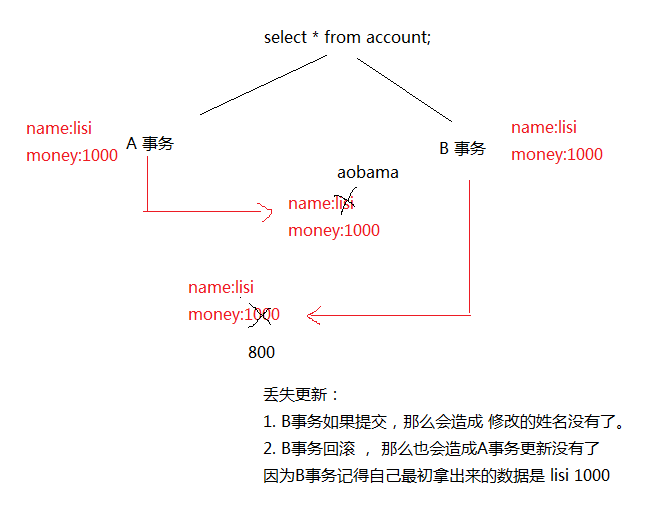

# 事务
## 定义
>一组sql语句的操作单元，组内所有的sql语句完成一个业务  
如果整组的sql语句都执行成功，则提交事务，改变数据  
有任何一条sql语句执行失败，则回滚事务，使数据回到操作前的状态,mysql中只有innodb和bdb支持事务。
## 事务的自动提交
    sql的执行分成两个阶段
        1.执行阶段
        2.将执行的结果提交到数据库阶段

    其中我们的事务日志就是保存执行阶段的结果，如果用于选择提交，则才将执行结果提交到数据库。
    MySql默认的执行方式叫自动提交，执行完毕，自动完成提交动作。
    因此，我们使用事务时，要关闭自动提交。
    通过设置 autocommit 来关闭/开启自动提交

    关闭自动提交 set autocommit=0；
    开启自动提交 set autocommit=1;
    手动提交:commit
    手动回滚:rollback;
## 事务的开启
```sql
START TRANSACTION; 
UPDATE tb7 set licnese=(licnese-5) WHERE nid=21; 
UPDATE tb7 set licnese=(licnese+5) WHERE nid=22; 
COMMIT; 
```
## 事务的特点ACID
1. 原子性：要么成功，要么失败，不存在一部分成功，一部分失败,即事务是原子工作单位

2. 一致性:事务完成时，必须使所有的数据都保持一致状态

3. 隔离性：由并发事务所做的修改必须与其他任何并发事务所做的修改隔离

4. 持久性：一旦事务执行完毕后，数据就存到数据库中去了，对系统的影响是永久的


## 事务的安全隐患
* 事务不考虑隔离级别设置就会产生一些问题
    * 读
        1. 脏读 
            一个事务读到另一个事务未提交的数据(读未提交)
        2. 不可重复读 
            一个事务读到了另外一个事务提交的数据，造成前后两次读到的数据不一致(读已提交)
        3. 可重复读 MySql 默认的隔离级别
            不管数据有没有改变，在事务中前后读的都是一样，所以会导致读不到最新的值(重复读)
        4. 幻读
            一个事务读到了另一个事务insert/delete的数据 ，造成前后查询结果不一致 。
    * 写
        1. 丢失更新
            1. 悲观锁
            2. 乐观锁

* 事务的隔离级别设置
    1. read uncommitted 读未提交
    2. read committed  读已提交
    3. repeatable read  重复读
    4. serializable  可串行化 
        > 如果有一个连接的隔离级别设置为了串行化 ，那么谁先打开了事务， 谁就有了先执行的权利， 谁后打开事务，谁就只能得着，等前面的那个事务，提交或者回滚后，才能执行。  但是这种隔离级别一般比较少用。 容易造成性能上的问题。 效率比较低。

    * 设置隔离级别
    ```SQL
    select @@transaction_isolation; --查看事务隔离级别
    --低版本 @@tx_isolation

    --设置隔离级别
    --session表示会话本次连接内有效，
    --global表示全局
    set session transaction isolation level read uncommitted;

    ```
* 按效率划分，从高到低
> 读未提交  > 读已提交  > 可重复读  > 可串行化
* 按拦截程度 ，从高到底
> 可串行化 > 可重复读 > 读已提交 >  读未提交

* 读未提交

> 引发问题： 脏读 

* 读已提交

> 解决： 脏读 ， 引发： 不可重复读

8 可重复读

> 解决： 脏读 、 不可重复读 ， 未解决： 幻读

* 可串行化

> 解决： 脏读、 不可重复读 、 幻读。但是效率低

* mySql 默认的隔离级别是 可重复读

* Oracle 默认的隔离级别是  读已提交

###需要掌握的

1. 在代码里面会使用事务 

		conn.setAutoCommit(false);


		conn.commit();

		conn.rollback();

2. 事务只是针对连接连接对象，如果再开一个连接对象，那么那是默认的提交。

3. 事务是会自动提交的。


##丢失更新




##解决丢失更新

* 悲观锁，利用数据库的排他锁

> 可以在查询的时候，加入 for update


* 乐观锁

> 要求程序员自己控制。 


##数据库连接池

>1. 数据库的连接对象创建工作，比较消耗性能。 

>2.一开始现在内存中开辟一块空间（集合） ， 一开先往池子里面放置 多个连接对象。  后面需要连接的话，直接从池子里面去。不要去自己创建连接了。  使用完毕， 要记得归还连接。确保连接对象能循环利用。


###自定义数据库连接池 


* 代码实现

* 出现的问题：

	1. 需要额外记住 addBack方法
 
 	2. 单例。
 
 	3. 无法面向接口编程。 
 
 		UserDao dao = new UserDaoImpl();
 		dao.insert();
 
 
 		DataSource dataSource = new MyDataSource();
 
 		因为接口里面没有定义addBack方法。 
 
 	4. 怎么解决?   以addBack 为切入点。

###解决自定义数据库连接池出现的问题。 

> 由于多了一个addBack 方法，所以使用这个连接池的地方，需要额外记住这个方法，并且还不能面向接口编程。

> 我们打算修改接口中的那个close方法。  原来的Connection对象的close方法，是真的关闭连接。 
> 打算修改这个close方法，以后在调用close， 并不是真的关闭，而是归还连接对象。


###如何扩展某一个方法?

> 原有的方法逻辑，不是我们想要的。 想修改自己的逻辑

1. 直接改源码  无法实现。

2. 继承， 必须得知道这个接口的具体实现是谁。 

3. 使用装饰者模式。 


##开源连接池

#### DBCP
>设置了rmoveAbandoned=true 那么在getNumActive()快要到getMaxActive()的时候，系统会进行无效的Connection的回收，回收的 Connection为removeAbandonedTimeout(默认300秒)中设置的秒数后没有使用的Connection，激活回收机制好像是getNumActive()=getMaxActive()-2。 有点忘了。 
　　logAbandoned=true的话，将会在回收事件后，在log中打印出回收Connection的错误信息，包括在哪个地方用了Connection却忘记关闭了，在调试的时候很有用。 
　　在这里私人建议maxWait的时间不要设得太长，maxWait如果设置太长那么客户端会等待很久才激发回收事件。 

1. 导入jar文件

2. 不使用配置文件：


		public void testDBCP01(){
		
			
			Connection conn = null;
			PreparedStatement ps = null;
			try {
				
				//1. 构建数据源对象
				BasicDataSource dataSource = new BasicDataSource();
				//连的是什么类型的数据库， 访问的是哪个数据库 ， 用户名， 密码。。
				//jdbc:mysql://localhost/bank 主协议：子协议 ://本地/数据库
				dataSource.setDriverClassName("com.mysql.jdbc.Driver");
				dataSource.setUrl("jdbc:mysql://localhost/bank");
				dataSource.setUsername("root");
				dataSource.setPassword("root");
				
				
				//2. 得到连接对象
				conn = dataSource.getConnection();
				String sql = "insert into account values(null , ? , ?)";
				ps = conn.prepareStatement(sql);
				ps.setString(1, "admin");
				ps.setInt(2, 1000);
				
				ps.executeUpdate();
				
			} catch (SQLException e) {
				e.printStackTrace();
			}finally {
				JDBCUtil.release(conn, ps);
			}
			
		}

2. 使用配置文件方式：


		Connection conn = null;
		PreparedStatement ps = null;
		try {
			BasicDataSourceFactory factory = new BasicDataSourceFactory();
			Properties properties = new Properties();
			InputStream is = new FileInputStream("src//dbcpconfig.properties");
			properties.load(is);
			DataSource dataSource = factory.createDataSource(properties);
			
			//2. 得到连接对象
			conn = dataSource.getConnection();
			String sql = "insert into account values(null , ? , ?)";
			ps = conn.prepareStatement(sql);
			ps.setString(1, "liangchaowei");
			ps.setInt(2, 100);
			
			ps.executeUpdate();
			
		} catch (Exception e) {
			e.printStackTrace();
		}finally {
			JDBCUtil.release(conn, ps);
		}


		

* C3P0

> 拷贝jar文件 到 lib目录

###不使用配置文件方式


		Connection conn = null;
		PreparedStatement ps = null;
		try {
			//1. 创建datasource
			ComboPooledDataSource dataSource = new ComboPooledDataSource();
			//2. 设置连接数据的信息
			dataSource.setDriverClass("com.mysql.jdbc.Driver");
			
			//忘记了---> 去以前的代码 ---> jdbc的文档
			dataSource.setJdbcUrl("jdbc:mysql://localhost/bank");
			dataSource.setUser("root");
			dataSource.setPassword("root");
			
			//2. 得到连接对象
			conn = dataSource.getConnection();
			String sql = "insert into account values(null , ? , ?)";
			ps = conn.prepareStatement(sql);
			ps.setString(1, "admi234n");
			ps.setInt(2, 103200);
			
			ps.executeUpdate();
			
		} catch (Exception e) {
			e.printStackTrace();
		}finally {
			JDBCUtil.release(conn, ps);
		}


###使用配置文件方式


			//默认会找 xml 中的 default-config 分支。 
			ComboPooledDataSource dataSource = new ComboPooledDataSource();
			//2. 设置连接数据的信息
			dataSource.setDriverClass("com.mysql.jdbc.Driver");
			

			//忘记了---> 去以前的代码 ---> jdbc的文档
			dataSource.setJdbcUrl("jdbc:mysql://localhost/bank");
			dataSource.setUser("root");
			dataSource.setPassword("root");
			
			//2. 得到连接对象
			conn = dataSource.getConnection();
			String sql = "insert into account values(null , ? , ?)";
			ps = conn.prepareStatement(sql);
			ps.setString(1, "admi234n");
			ps.setInt(2, 103200);


##DBUtils

###增删改


				//dbutils 只是帮我们简化了CRUD 的代码， 但是连接的创建以及获取工作。 不在他的考虑范围
		QueryRunner queryRunner = new QueryRunner(new ComboPooledDataSource());
	
		
		//增加
		//queryRunner.update("insert into account values (null , ? , ? )", "aa" ,1000);
		
		//删除
		//queryRunner.update("delete from account where id = ?", 5);
		
		//更新
		//queryRunner.update("update account set money = ? where id = ?", 10000000 , 6);

###查询

1. 直接new接口的匿名实现类


		QueryRunner queryRunner = new QueryRunner(new ComboPooledDataSource());
	

		Account  account =  queryRunner.query("select * from account where id = ?", new ResultSetHandler<Account>(){

			@Override
			public Account handle(ResultSet rs) throws SQLException {
				Account account  =  new Account();
				while(rs.next()){
					String name = rs.getString("name");
					int money = rs.getInt("money");
					
					account.setName(name);
					account.setMoney(money);
				}
				return account;
			}
			 
		 }, 6);
		
		System.out.println(account.toString());

2. 直接使用框架已经写好的实现类。


	* 查询单个对象

		QueryRunner queryRunner = new QueryRunner(new ComboPooledDataSource());
		//查询单个对象
		Account account = queryRunner.query("select * from account where id = ?", 
				new BeanHandler<Account>(Account.class), 8);
	
	
	* 查询多个对象

		QueryRunner queryRunner = new QueryRunner(new ComboPooledDataSource());
		List<Account> list = queryRunner.query("select * from account ",
				new BeanListHandler<Account>(Account.class));

###ResultSetHandler 常用的实现类
以下两个是使用频率最高的

	BeanHandler,  查询到的单个数据封装成一个对象
	BeanListHandler, 查询到的多个数据封装 成一个List<对象>

------------------------------------------

	ArrayHandler,  查询到的单个数据封装成一个数组
	ArrayListHandler,  查询到的多个数据封装成一个集合 ，集合里面的元素是数组。 
	
	
	
	MapHandler,  查询到的单个数据封装成一个map
	MapListHandler,查询到的多个数据封装成一个集合 ，集合里面的元素是map。 


ColumnListHandler
KeyedHandler
ScalarHandler