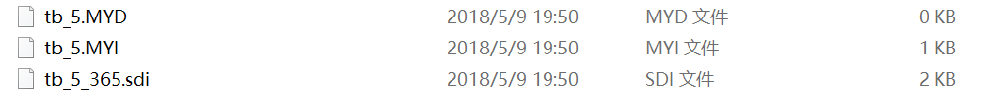

# MySql数据的备份还原
## **方案1:**
1. 适用于myisam存储引擎  

   
    >把这些文件直接备份  
    >需要的时候直接复制这些文件到新的数据库中就可以了

2. 通用的备份  
    + 将建表结构与插入数据的sql语句生成并保存
        >利用mysql提供的工具集，导出sql语句  
        >在mysql的bin目录下，有一个mysqldump.exe
        
        使用方法:
        

          mysqldump -uroot -p mydatabase>e:/mydatabase.sql
        

        还原的时候在mysql client中中通过source指令来操作
         

         source e:/mydatabase.sql;
        

3. 常用的备份操作
    * 备份整个数据库的表
         

          mysqldump -uroot -p mydatabase>e:/mydatabase.sql
        

    * 备份数据库内的某张表或者多张表
         

          mysqldump -uroot -p mydatabase student>e:/student.sql 
          mysqldump -uroot -p mydatabase tbl1 tbl2>e:/mydatabase.sql
        

    
      