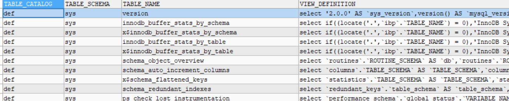

# mysql视图的操作
## 什么是视图
>&nbsp;&nbsp;&nbsp;&nbsp;&nbsp;&nbsp;&nbsp;&nbsp;视图是指计算机数据库中的视图，是一个虚拟表，其内容由查询定义。同真实的表一样，视图包含一系列带有名称的列和行数据。但是，视图并不在数据库中以存储的数据值集形式存在。行和列数据来自由定义视图的查询所引用的表，并且在引用视图时动态生成。

## 视图的基本定义
1. 创建视图的基本语句
    ```sql
        //可以指定新的列名
        create view [列1，列2] v_student
        as 
        select  stu_name,stu_date from student;
     ```

2. 对视图的insert,update,delete  
    >对视图的增删改是会影响原表的  
    >因为视图是一个虚表，数据还是在原表中  
    >视图本身不保存数据
    _<p style="color:red;">注意:一般情况下，视图仅用于select,不要对视图进行增删改</p>_

    常见的视图操作
    ```sql
    //删除视图
    drop view v_name;

    //修改视图，其实就是修改创建视图的sql语句
    ALTER VIEW v1 AS
    SELECT A.nid,B. NAME
    FROM A
    LEFT JOIN B ON A.id = B.nid
    LEFT JOIN C ON A.id = C.nid
    WHERE A.id > 2 AND C.nid < 5

    //查看系统中所有的视图
    SELECT * FROM information_schema.VIEWS; 

    ```
    **查看系统中的视图**
    
3. 视图的基本作用
    + <div style='color:chocolate;'>
        通过视图可以简化复杂的业务逻辑  

        对于一些比较复杂的逻辑，可以先使用视图完成一部分的逻辑，再在视图的基础上完成另外的逻辑
    </div>

4. 视图的执行过程和执行算法
    >存在两种执行算法  
    >&nbsp;&nbsp;1. merge  
    >&nbsp;&nbsp;2. temptable  
    <br/>
    指得是视图在什么时候执行，依据哪些方式执行  
    merge 合并的方式执行,每当执行的时候，将视图的sql语句与外部的SQL语句合并在一起，一起执行
    <br/>
    temptable：临时表方式,每当查询的时候，先执行视图创建一个临时表，再从临时表中查询   
    当用户创建视图时mysql默认使用一种undefined的处理算法,会自动选择两种算法中的一种进行

5. 视图的注意事项
    <div style='color:chocolate;'>
        1.尽量使用视图完成读操作。<br/>
        2.如果使用视图，要注意对视图的增删改也是对真实表的增删改，会立即生效。<br/>
        3.删除视图时是不会销毁真实表中的数据。<br/>
        4.如果做得是外部接口，一个数据库多个应用，针对每一个应用，采用不同的视图接口。
    </div>


    