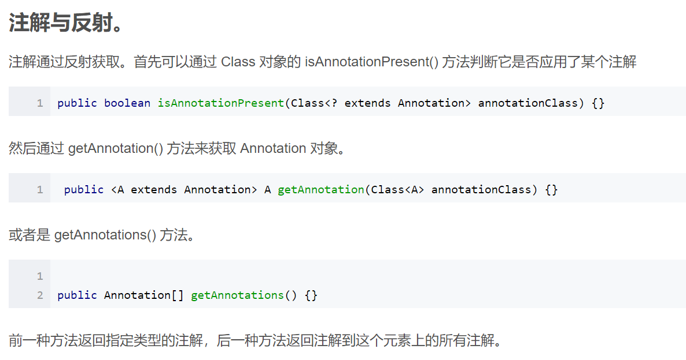

## Annotation

### 什么是注解？
>注解和接口，类一样，都属于数据类型
注解可以在变量、方法、类之上加载
注解可以有属性，也可以没有属性，@Override @Test(timeout=1000)
注解有作用范围(源码，编译期间，运行期间)
源码期间有效: 文档注释中的@author，@see，作用使用javadoc 命令将当前的源码生成帮助文件，并可以识别相关的注解
编译期间:@Override,@SuppressWarnings({"unused","rawtypes"})
运行期间有效:@Test

### 常见的注解
1. @Override
2. @SuppressWarnings
3. @Deprecated
2. @Test
3. @beforeClass
4. @afterClass
5. @before
6. @after
7. @WebServlet servlet的注解
8. @WebListener Listener 的注解
9. @WebFilter   Filter的注解

### 元注解
>元标签有 @Retention、@Documented、@Target、@Inherited、@Repeatable 5 种。
>
>@Retention
Retention 的英文意为保留期的意思。当 @Retention 应用到一个注解上的时候，它解释说明了这个注解的的存活时间。
>它的取值如下  ： 
>- RetentionPolicy.SOURCE 注解只在源码阶段保留，在编译器进行编译时它将被丢弃忽视。 
>- RetentionPolicy.CLASS 注解只被保留到编译进行的时候，它并不会被加载到 JVM 中。 
>- RetentionPolicy.RUNTIME 注解可以保留到程序运行的时候，它会被加载进入到 JVM 中，所以在程序运行时可以获取到它们。
>
>@Documented
顾名思义，这个元注解肯定是和文档有关。它的作用是能够将注解中的元素包含到 Javadoc 中去
>
>@Target
Target 是目标的意思，@Target 指定了注解运用的地方。
你可以这样理解，当一个注解被 @Target 注解时，这个注解就被限定了运用的场景。
类比到标签，原本标签是你想张贴到哪个地方就到哪个地方，但是因为 @Target 的存在，它张贴的地方就非常具体了，比如只能张贴到方法上、类上、方法参数上等等。@Target 有下面的取值
ElementType.ANNOTATION_TYPE 可以给一个注解进行注解
ElementType.CONSTRUCTOR 可以给构造方法进行注解
ElementType.FIELD 可以给属性进行注解
ElementType.LOCAL_VARIABLE 可以给局部变量进行注解
ElementType.METHOD 可以给方法进行注解
ElementType.PACKAGE 可以给一个包进行注解
ElementType.PARAMETER 可以给一个方法内的参数进行注解
ElementType.TYPE 可以给一个类型进行注解，比如类、接口、枚举
>
>@Inherited
Inherited 是继承的意思，但是它并不是说注解本身可以继承，而是说如果一个超类被 @Inherited 注解过的注解进行注解的话，那么如果它的子类没有被任何注解应用的话，那么这个子类就继承了超类的注解。 
>
>@Repeatable
Repeatable 自然是可重复的意思。@Repeatable 是 Java 1.8 才加进来的，所以算是一个新的特性。
什么样的注解会多次应用呢？通常是注解的值可以同时取多个。
举个例子，一个人他既是程序员又是产品经理,同时他还是个画家。

### 自定义注解
```java
@Retention(RetentionPolicy.RUNTIME) 
@Target(ElementType.METHOD)
public @interface MyAnnotation
{
	long timeout() default -1;
[public] 属性类型 属性名称()[默认值];
}

//属性类型只支持以下类型
short byte int long  
float double boolean char
String Class Annotation Enumeration
以及以上数据类型的一维数组类型
```

### 通过反射获取注解


### 注解的作用
1. 配置作用
>配置信息不会频繁发生修改，可以使用注解配置
>经常发生修改的的话，还是使用传统的方式比较好。

2. 编译检查
3. 生成帮助文档


