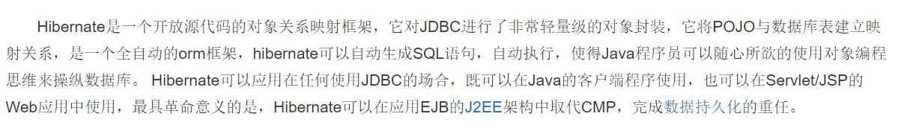
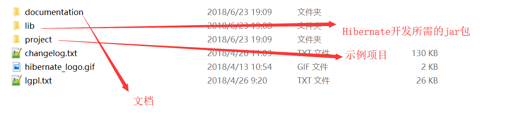
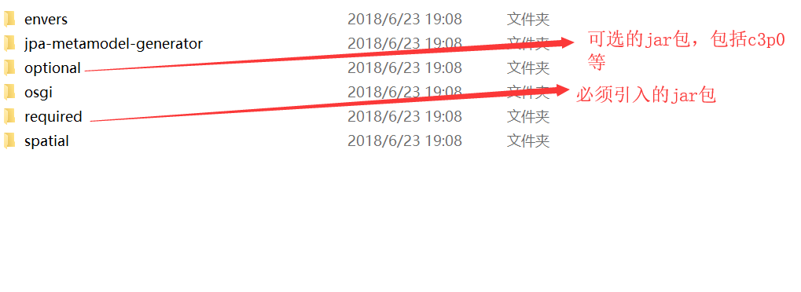
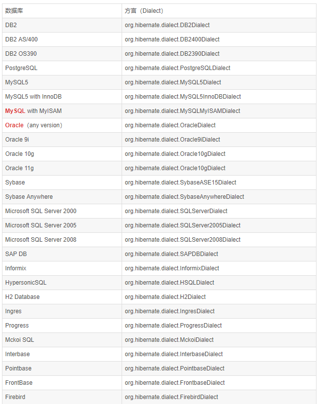

## Hibernate 学习

### Hibernate 入门


>Hibernate 是一个<strong>持久层</strong>的<strong>ORM</strong>框架。
对象关系映射（Object Relational Mapping，简称ORM）模式是一种为了解决面向对象与关系数据库存在的互不匹配的现象的技术。简单的说，ORM是通过使用描述对象和数据库之间映射的元数据，将程序中的对象自动持久化到关系数据库中。从而是我们可以操纵对象就可以操作数据库中的表。

### Hibernate 下载解压后的目录介绍 



### 创建一个Hibernate 项目
1. 引入相应的jar包
    1. 数据库驱动包
    2. Hibernate开发必须的jar包
    3. 日志jar包
2. 创建表和实体类

3. 创建映射配置文件(xml)
>命名可以任意,但是尽量统一，默认的命名规范是类名.hbm.xml
```xml 
<?xml version="1.0" encoding="UTF-8"?>
<!DOCTYPE hibernate-mapping PUBLIC 
    "-//Hibernate/Hibernate Mapping DTD 3.0//EN"
    "http://www.hibernate.org/dtd/hibernate-mapping-3.0.dtd">
<hibernate-mapping>
	<!-- 建立类与表的映射 -->
	<class name="com.ph.test.Customer" table="cst_customer" catalog="crm" >
		<!-- id 建立属性与主键的对应关系 -->
		<id name="cust_id" column="cudt_id" length="32">
			<generator class="native" />
		</id>
		<!-- 普通属性与表的字段的对应 -->
		<property name="cust_name" column="cust_name" length="32" not-null="true" />
		<property name="cust_source" >
			<column name="cust_source" length="32" default="null">
            </column>
		</property>
		<property name="cust_industry" column="cust_industry" length="32" />
		<property name="cust_level" column="cust_level" length="32" />
		<property name="cust_phone" column="cust_phone" length="20" />
		<property name="cust_mobile" column="cust_mobile" length="11" />
	</class>
</hibernate-mapping>s
```
4. Hinernate 核心配置文件(hibernate.cfg.xml)
    >基本配置
    ```xml
    <?xml version="1.0" encoding="UTF-8"?>
    <!DOCTYPE hibernate-configuration PUBLIC
        "-//Hibernate/Hibernate Configuration DTD 3.0//EN"
        "http://www.hibernate.org/dtd/hibernate-configuration-3.0.dtd">
    <hibernate-configuration>
        <session-factory>
            <!-- 连接数据库的基本参数 -->
            <property name="hibernate.connection.driver_class">com.mysql.cj.jdbc.Driver</property>
            <property name="hibernate.connection.url">jdbc:mysql://localhost:3306/crm?useSSL=false&amp;serverTimezone=UTC</property>
            <property name="hibernate.connection.username">root</property>
            <property name="hibernate.connection.password">123456</property>
                    
            <!-- 配置Hibernate的方言 -->
            <property name="hibernate.dialect">org.hibernate.dialect.MySQL5InnoDBDialect</property>	
            
            <!-- 打印执行的Sql语句 -->
            <property name="hibernate.show_sql">true</property>
            <!-- 格式化Sql语句 -->
            <property name="hibernate.format_sql">true</property>
            
            <!-- 自动建表 -->
            <property name="hibernate.hbm2ddl.auto">update</property>
            
            <!-- 配置映射文件 -->
            <mapping resource="com/ph/test/Customer.hbm.xml"/>
        </session-factory>
    </hibernate-configuration>
    ```

    1. 必须的核心配置
        1. 连接数据库的基本参数
            1. `<property name="hibernate.connection.driver_class">com.mysql.cj.jdbc.Driver</property>`
		    2. `<property name="hibernate.connection.url">jdbc:mysql://localhost:3306/crm?useSSL=false&amp;serverTimezone=UTC</property>`
		    3. `<property name="hibernate.connection.username">root</property>`
		    4. `<property name="hibernate.connection.password">123456</property>`
        2. 方言
            1. `<property name="hibernate.dialect">org.hibernate.dialect.MySQL5InnoDBDialect</property>	`
            
        3. 映射文件
		    1. `<mapping resource="com/ph/test/Customer.hbm.xml"/>`

    2. 可选的配置
        1. 显示SQL
		    1.  `<property name="hibernate.show_sql">true</property>`
		2. 格式化SQL语句
		    1. `<property name="hibernate.format_sql">true</property>`
        3. 自动建表
            1. `<property name="hibernate.hbm2ddl.auto">update</property>`
            2. 可选属性说明
                1. none  不使用Hibernate的自动建表
                2. create 创建表,如果数据库中已经有表会删除原有表
                3. update 没有表才创建，可以更新表的结构
                4. create-drop 创建表,如果数据库中已经有表会删除原有表。最后程序结束的时候还会删除表
                5. validate 如果没有表不会创建表，会验证表和映射文件