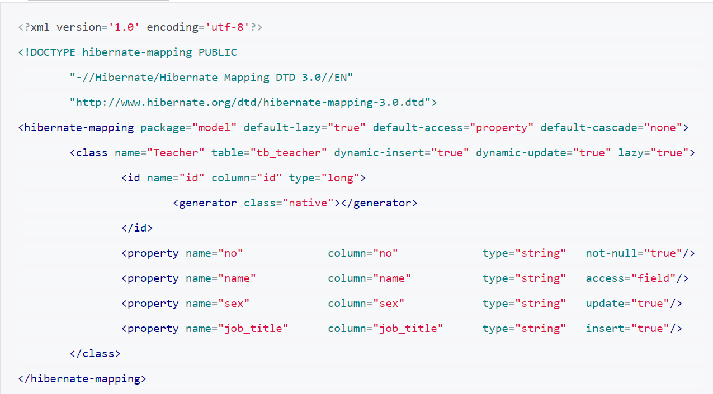
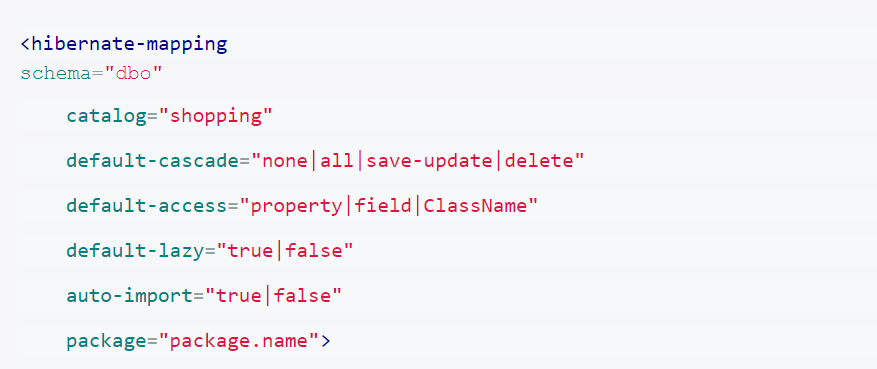
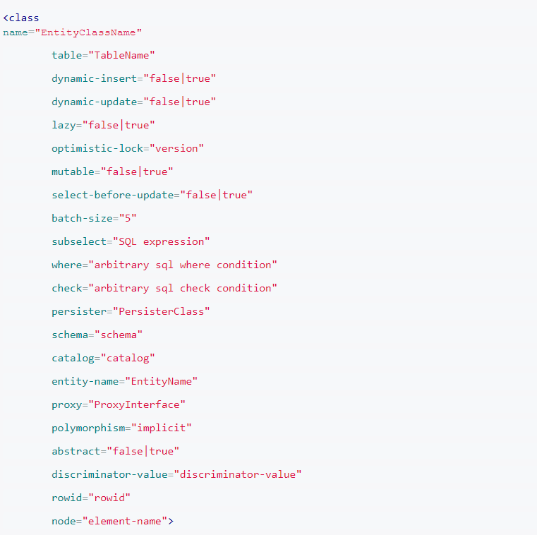
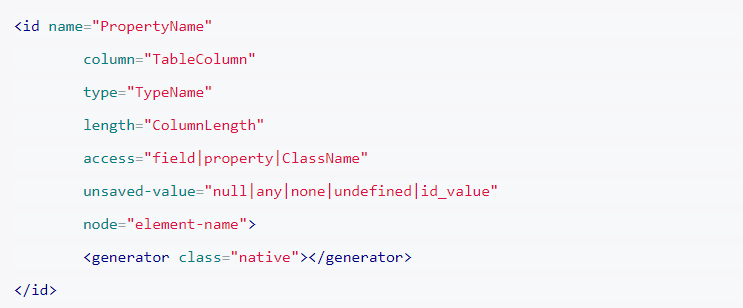
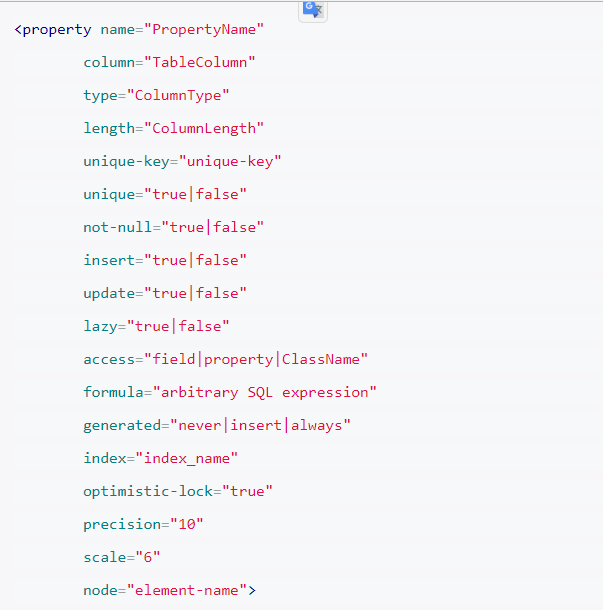
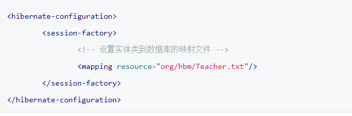

## 通过配置文件映射
>Hibernate的核心功能是根据数据库到实体类的映射，自动从数据库绑定数据到实体类。
>使我们操作实体类(Java对象)就能对数据库进行增、删、查、改，而不用调用JDBC API使数据操作变得简单而不繁琐。

### 映射配置文件基础(XXX.hbm.xml)
>说明：本节只是对Hibernate的映射文件配置进行列举说明，若你是新手刚接触Hibernate那么你可以通过下面的配置可以对Hibernate的映射配置有一个大致的了解，有看不懂的地方也不需要理会，因为下面配置只是方便查阅的。要想知道其中的原理请阅读本文的后面的章节。

1. 映射文件示例及说明
    
    1. 映射配置文件配置文件的作用是：用来确定持久化类与数据库表的关系。
    2. 命名规则与存放位置：映射文件的命名可以任意只是文件后缀是.xml，也可以多个持久化类使用同一个映射文件。但是为了便于维护和项目的可读性，一般为每个持久化类些单独的映射文件，并使用`XXX.hbm.xml`的形式来命名，“XXX”既是持久化类名，<strong>并且持久化类与其映射文件放在同一目录下</strong>。 
2. `hibernate-mapping`节点配置说明
    
    >如上展示了hibernate-mapping节点常用的配置，hibernate-mapping节点是XXX.hbm.xml配置文件的根节点，下面对其配置进行详细的说明：
    1. schema:数据库schema。
    2. catalog:数据库catalog。
    3. default-cascade:默认级联模式，为hibernate-mapping节点下的所有class节点设置默认的级联操作，默认是none。
    4. default-access:默认的实体类属性访问模式，取值为property表示访问getter、setter方法间接访问实体类字段，取值为field表示直接访问实体类字段(类成员变量)。
    5. default-lazy:默认检索模式，为hibernate-mapping节点下的所有class节点设置默认的检索模式，默认是true，即使用懒加载。
    6. auto-import:在查询语言中是否可以使用不包含包名的类名，为true时表示可以在HQL中只使用类名，为false时表示在HQL必须使用类全路径名。
    7. package:设置映射文件class中节点默认的包名称，配置了这个属性，那么在class节点中的name属性就只需指定类名就可以了，不用再写类全名。

3. class节点配置说明
    
    >如上展示了class节点常用的配置，class节点是hibernate-mapping节点的子节点，是面对其配置进行详细的说明：

    1. name:实体类名，默认要写类全名，若配置了hibernate-mapping节点的package属性则可以只写类名。
    2. table:此实体类对应的数据库表名。
    3. dynamic-insert:保存当前实体类时是否动态的产生insert语句，推荐使用true。
    4. dynamic-update:当更新实体类时是否动态的产生update语句，推荐使用true。
    4. lazy:是否使用懒加载检索策略，默认true。
    5. optimistic-lock:乐观锁定，默认是version:。决定乐观锁定的策略。
    6. mutable:类是否会发生改变，如果类实例对应的数据库表记录不会发生更新，可将其设为false，适用于单纯的Insert操作不使用update操作。
    7. select-before-update:是否在执行update前执行一下select以确定对象真的改变了才执行update。
    8. batch-size:用于设置批次操作的SQL语句的数量，默认为1。
    8. subselect:一个SQL子查询，它将一个不可变并且只读的实体映射到一个数据库的子查询。
    9. where:一个SQL查询的where条件，查询这个类的对象时会一直增加这个条件。
    11. check:这是一个SQL表达式，用于为自动生成的schema添加多行约束检查。
    12. persister:指定持久化实现类，通过指定持久化类，我们可以实现自定义的持久化方法。持久化类为ClassPersister接口的实现
    13. schema:数据库schema。
    14. catalog:数据库catalog。
    15. entity-name:Hibernate3新增特性，用于动态模型（Dynamic Model）支持。Hibernate3允许一个类进行多次映射(前提是映射到不同的表)。
    16. proxy:指定一个接口，在延迟装载时作为代理使用。
    17. polymorphism:界定是隐式还是显式的使用多态查询，默认值为implicit(隐式)。
    18. abstract:是否是抽象类配置(对应的实体类不一定是抽象的，只是配置是抽象的)
    19. discriminator-value:一个用于区分不同的子类的值，在多态行为时使用，默认和类名一样。
    30. rowid:Hibernate可以使用数据库支持的所谓的ROWID，如：Oracle数据库，如果你设置这个可选的rowid，Hibernate可以使用额外的字段rowid实现快速更新。
    21. node:配置说明。
4. id节点配置说明
    
    >如上展示了id节点常用的配置，id节点是class节点的子节点，是面对其配置进行详细的说明：

    1. name:实体类属性名，用做数据库表主键的成员变量。
    2. column:数据库主键字段。
    3. type:数据库字段类型。
    4. length:数据库字段长度。
    5. access:默认的实体类属性访问模式，取值为property表示访问getter、setter方法间接访问实体类字段，取值为field表示直接访问实体类字段(类成员变量)。
    6. unsaved-value:一个特定的标识属性值，用来标志该实例是刚刚创建的，尚未保存。
    7. node:配置说明。
    8. <generatorclass="native"></generator>:用于设置主键的生成策略。

5. generator节点主键生成策略
    >generator用来配置主键生成策略，generator节点是id节点的子节点，下面说明Hibernate提供的内置标示符生成器：

    1. increment:适用于代理主键，由Hibernate自动以递增的方式生成标识符，每次增量为1。ID必须为long、int、short类型。
    2. identity:适用于代理主键，由底层数据库生成标识符，前提条件是底层数据库支持自动增长的字段类型，例如：DB2、MySQL、MS SQLServer、Sybase等。OID必须是long、int、short类型。
    3. sequence:适用于代理主键，Hibernate根据底层数据库的序列来生成标识符，前提条件是底层数据库支持序列，例如DB2、Oracle等。OID必须是long、int、short类型。
    4. hilo:适用于代理主键，Hibernate根据high/low算法来生成标识符。OID必须是long、int、short类型；high/low算法生成的标识符只能在一个数据库中保证唯一。
    5. native:适用于代理主键，根据底层数据库对自动生成标识符的支持能力，来选择identity、sequence或hilo。OID必须是long、int、short类型。
    6. uuid.hex:适用于代理主键，Hibernate采用128位的UUID算法来生成标识符,UUID能在网络环境下生成唯一的字符串标识符。
    6. assigned:适用于自然主键，由Java应用程序负责生成标识符，为了能让Java应用程序设置OID，不能把setID()方法申明为private类型。
    6. select:适用于遗留数据库中的代理主键或自然主键，由数据库中的触发器来生成标识符。
    8. foreign:用另一个关联对象的标识符来作为当前对象的标识符，主要用于一对一的关联场合。
    9. 以下总结了几种常用数据库系统可用的标识符生成器：
        1. MySQL：increment、identity、hilo、native
        2. MS SQL Server：increment、identity、hilo、 native
        3. Oracle：sequence、seqhilo、hilo、increment、native
        4. 跨平台开发：native

6. property节点配置说明
    
    >如上展示了property节点常用的配置，property节点是class节点的子节点，是面对其配置进行详细的说明：

    1. name:实体类属性名。
    2. column:对应的数据库字段名。
    3. type:数据库字段类型。
    4. length:数据库字段长度。
    5. unique-key:为此字段创建唯一约束，属性值即为数据库唯一约束名，只影响自动生成的schema脚本。
    6. unique:字段是否唯一。
    7. not-null:字段能否为空。
    8. insert:在insert时是否含有此字段。
    9. update:在update时是否含有此字段。
    10. lazy:是否采用延迟加载策略。
    11. access:默认的实体类属性访问模式，取值为property表示访问getter、setter方法间接访问实体类字段，取值为field表示直接访问实体类字段(类成员变量)。
    12. formula:一个SQL表达式，定义了这个计算属性的值，计算属性没有和它对应的数据库字段。
    13. generated:设置此属性值是否由数据库生成的。
    14. index:为此字段创建索引，属性值即为数据库索引名，只影响自动生成的schema脚本。
    15. optimistic-lock:指定这个属性在做更新时是否需要获得乐观锁定，默认为true。
    16. precision:用于设置数字类型数据的有效数字位数。
    17. scale:用于设置数字类型数据的小数位数。
    18. node:配置说明。

7. 映射文件不使用默认的命名规则和存放位置
    > 前面说过，为了便于维护和项目的可读性，一般为每个持久化类些单独的映射文件，并使用XXX.hbm.xml的形式来命名，“XXX”既是持久化类名，并且持久化类与其映射文件放在同一目录下。那么下面说说使用特殊命名的映射文件：如果实体类Teacher在命名空间org.model下，而其配置文件名为Teacher.txt在org.hbm下，那么在配置hibernate.cfg.xml文件中配置映射文件时的配置应如下：

    

8. 实体类属性到数据库表字段映射详解
   1. 实体类属性映射原理
        >Hibernate是通过Java反射机制访问实体类的属性或getter、setter方法的，对其赋值或读取。值得注意的是：Java应用程序不能访问实体类private的属性或getter、setter方法，但是Hibernate没有这个限制，它能够访问各种访问级别的方法或属性。在实体类中，既可以把属性定义为基本类型，也可以定义成包装类型，它们对应相同的Hibernate类型。在实际应用中推荐使用包装类型作为实体类的属性。
    2. Hibernate访问实体类属性的策略
        >在对象——映射文件中property元素的access属性用于指定Hibernate访问持久化类的属性方式。属性有以下两个可选值：property和field，区别在于property表示Hibernate通过实体类相应的getter、setter方法来访问类属性，这是默认值；field表示Hibernate运用Java反射机制直接访问类属性。
        使用property访问形式可以在实体类的访问方法中加入程序逻辑。
        ```xml
        package model;
        public class People
        {
            private String firstName;
            private String lastName;
            private String sex;
            
            /** 数据处理 */
            public String getName()
            {
                return firstName + " " + lastName;
            }
            /** 数据验证 */
            public void setSex(String sex)
            {
                if("男".equals(sex) || "女".equals(sex))
                {
                    this.sex = sex;
                }
            }
            
            //其他省略...
        }
        <hibernate-mapping package="model">
            <class name="People" table="tb_people">
                <!-- 省略其他 -->
                <property name="name" 	column="name" 	type="string" 	access="property"/>
                <property name="sex" 	column="sex"	type="string"	access="property"/>
            </class>
        </hibernate-mapping>
        ```
        >以上示例的实体类中并没有name属性只含有getName和setName方法，但是由于映射文件配置的是access="property"，所以映射数据库的表tb_people字段是name。在实体类中也对字段sex进行了数据验证。

    3. 设置实体类派生属性
        >并不是实体类中的所有属性都和数据库表字段对应，在实体类中的有些值必须通过在数据库中计算才能得出来，如表中的People类中的avgAge(平均年龄)属性。此时我们可以利用property元素的formula属性设置一个SQL表达式，Hibernate会将根据它计算出派生属性的值。例如：
        ```xml
        <property name="avgAge" formula="select avg(age) from tb_people"/>
        根据上面的配置，查询数据时，Hibernate生成的SQL格式如下：
        select name,sex ...,( select avg(age) from tb_people ) as avgAge from tb_people where id=1
        ```
    4. 控制insert和update
        >默认情况下当更新实体类或保存实体类时，Hibernate自动生成的insert或update语句包含所有字段，这会影响数据库性能。通过property元素和class元素也可以控制实体类属性的update或insert行为，具体配置说明如下：

        1. 元素:保存当前实体类时是否动态的产生insert语句，推荐使用true。
        2. 元素:当更新实体类时是否动态的产生update语句，推荐使用true。
        3. class元素mutable:类是否会发生改变，如果类实例对应的数据库表记录不会发生更新，可将其设为false，适用于单纯的Insert操作不使用update操作。
        4. property元素insert:在insert时是否含有此字段。
        5. property元素update:在update时是否含有此字段。

    5. 处理SQL引用标识符
        >当数据库表或字段名中含有空格等特殊字符时，映射配置文件也要有所变化，如下：
        ```xml
        <property name="homeAddress" column="'Home Address'" type="string"/>
        ```
        >Hibernate会根据具体底层数据库做相应的处理，MS SQL Server中的形式：[Home Address]，MySQL中的形式：'Home Address'。
9. 实体类属性映射的命名策略
    >在开发软件时，通常会要求每个开发人员遵守共同的命名策略，例如：数据库的表名及字段名的所有字符都要大写，表明以"S"结尾等。当遵守命名约定时，在配置映射文件时只需要设置实体类的属性名，数据库的字段名会根据命名约定自动生成默认值，可以简化配置文件。Hibernate的默认命名策略是：数据库名与实体类名一样，字段名与实体类属性名一样。如下：

    ```xml
    <class name="People"><!-- 默认 table="People" -->
        <id name="id"><!-- 默认 column="id" -->
            <generator class="native"></generator>
        </id>
        <property name="name"/><!-- 默认 column="name" -->
        <property name="sex"/><!-- 默认 column="sex" -->
    </class>
    ```
    > Hibernate允许我们自定义命名策略，我们需要实现org.hibernate.cfg.NamingStrategy接口。对于这一接口Hibernate已经提供了两个实现参考：

    1. org.hibernate.cfg.DefaultNamingStrategy
    2. org.hibernate.cfg.ImprovedNamingStrategy
    3. org.hibernate.cfg.NamingStrategy接口的说明：
        1. classToTableName(String className)方法：如果class元素没有显示设置表名，Hibernate调用该方法生成默认的表名。
        2. tableName(String tableName)方法：如果class元素显示设置了表名，Hibernate调用该方法生成命名约定的表名。
        3. propertyToColumnName(String propertyName)方法：如果property元素没有显示设置字段名，Hibernate调用该方法生成默认的字段名。
        4. columnName(StringcolumnName)方法：如果property元素显示设置了字段名，Hibernate调用该方法生成命名约定的字段名。

10. 主键映射
    1. Hibernate使用对象标识符来区分实体类
        >数据库使用主键字段来区分不同的记录，Java语言使用内存地址来区分不同的对象，而Hibernate使用OID统一两者之间的矛盾，OID是关系数据库中的主键在Java的实体类中的等价物，在映射配置文件中配置与数据库表主键字段对应的实体类属性(使用id元素配置的字段)就是OID。
        Hibernate包含许多内置的标示符生成器，他们的用法如下：

        ```xml
        <id name="id">
            <meta attribute="scope-set">private</meta>
            <generator class="increment"></generator>
        </id>
        <id name="id">
            <meta attribute="scope-set">private</meta>
            <generator class="identity"></generator>
        </id>
        <id name="id">
            <meta attribute="scope-set">private</meta>
            <generator class="sequence">
                <param name="sequence">sequence_name</param>
            </generator>
        </id>
        <id name="id">
            <meta attribute="scope-set">private</meta>
            <generator class="hilo">
                <param name="table">hi_value</param>
                <param name="cloumn">next_value</param>
                <param name="max_lo">100</param>
            </generator>
        </id>
        <id name="id">
            <meta attribute="scope-set">private</meta>
            <generator class="native"></generator>
        </id>
        ```
    2. Hibernate映射自然主键
        >自然主键是具有业务含义的主键，如果从数据库表设计的角度看，应该避免使用自然主键，尽量使用不含业务逻辑的代理主键。映射单一自然主键的方法与其他的一样，如果要映射复合自然主键方式如下：
        ```xml
        <composite-id>
            <key-property name="name" column="name"/>
            <key-property name="address" column="address"/>
        </composite-id>
        ```
11. 自定义主键生成方式
    >所有的主键生成器都实现org.hibernate.id.IdentifierGenerator接口。这是一个非常简单的接口，我们可使用自己特定的实现。如果需要在配置文件中加载用户自定义的参数还需要实现接口org.hibernate.id.Configurable。例如：

    ```java
    public class KeyUtils implements org.hibernate.id.IdentifierGenerator, org.hibernate.id.Configurable
    {
        private String formatDateString;
        @Override
        public void configure(Type type, Properties params, Dialect d) throws MappingException
        {
            formatDateString = params.getProperty("formatDateString");
            if(formatDateString.length() < 14)
            {
                formatDateString="yyyyMMddhhmmss";
            }
        }
        @Override
        public Serializable generate(SessionImplementor session, Object object) throws HibernateException
        {
             Date today = new Date();
            SimpleDateFormat formatDate = new SimpleDateFormat(formatDateString);
            String time = formatDate.format(today);
            return time;
         }
    }
     ```
     ```xml
    <id name="id" column="id">  
         <generator class="org.KeyUtils">  
            <param name="formatDateString">yyyyMMddhhmmss</param>
        </generator>  
    </id>  
     ```
    > 在org.hibernate.id包中有许多Hibernate抽象的OID生成器，我们可以继承这些抽象类来完成自定义的主键生成器，例如抽象类：org.hibernate.id.AbstractUUIDGenerator。
