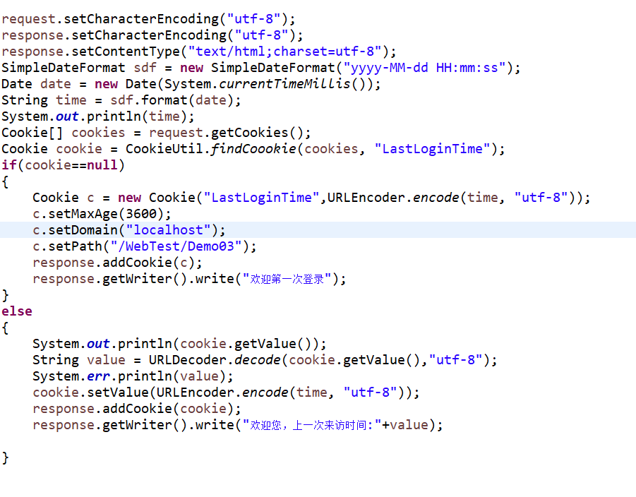
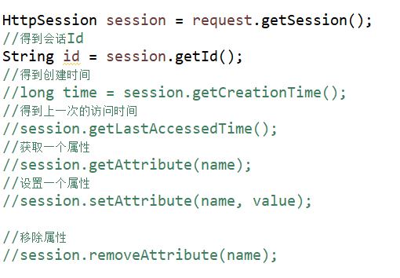

## Cookie和Session
**************
### Cookie
> 由服务端发送给客户端的一份小数据，保存在客户端上。这份数据会在客户端和服务器之间来回发送

*应用场景
1. 自动登录
2. 浏览记录

* 为什么要有Cookie
>Http的请求是无状态的，客户端与服务器在通讯的时候是无状态的，客户端第二次访问服务器的时候，服务器根本不知道这个客户端来访问过。为了收集用户习惯，让用户体验更好，就有了Cookie

* Cookie的使用
```java
//创建cookie并添加到Response中
Cookie cookie = new Cookie("name", "张三");
response.addCookie(cookie);

//从请求中获取Cookie
Cookie[] cookies = request.getCookies();
if(cookies!=null)	
{
	for (Cookie cookie : cookies)
	{
		System.out.println(cookie.getName()+":"+cookie.getValue()+",version"+cookie.getVersion());
	}
}

//设置cookie的有效期，以秒为单位,默认为负值，以秒为单位
//负值表示关闭浏览器cookie就失效，0表示立马删除Cookie
cookie.setMaxAge(3600);

//设置新的值
cookie.setValue();

//用于指定只有请求了指定的域名才会带上该cookie
cookie.setDomain("localhost");

//只有访问该域名下的/WebTest/GetCookie.do才会带上该Cookie
cookie.setPath("/WebTest/GetCookie.do");

//清除Cookie
cookie.setMaxAge(0);
```


*Cookie的安全问题
>由于Cookie会保存在客户端上,所以有安全隐患问题
>除此之外，cookie的大小和个数有限制
>一个Web工程有最多20个cookie，浏览器最多保存300个cookie，每个cookie大小最多为4k

### Session
>会话，一种基于Cookie的会话机制，Session是数据存放在服务器上。


### Session 何时创建
* 在Servlet中使用request.getSession() 时创建Session

### Session何时销毁
* 服务器关闭
* Session 会话时间过期，默认有效期是30分钟

注意：Session是依赖于Cookie的。浏览器关闭后，保存SessionId的Cookie会被删除，浏览器重启后是访问不到之前的Session的，但是如果关闭时，客户端没有通知服务器的话，Session不会从服务器内存中销毁，直到过期自动销毁