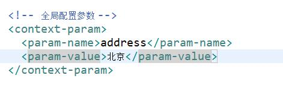
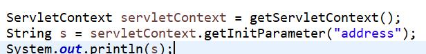
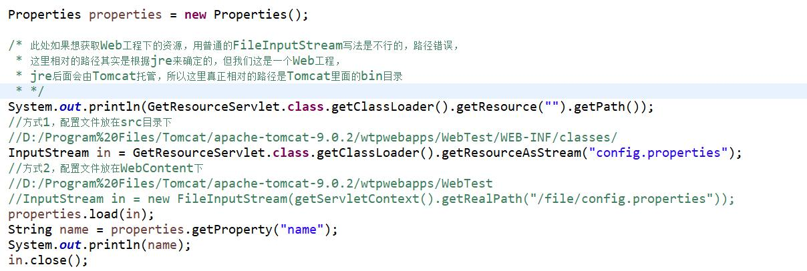
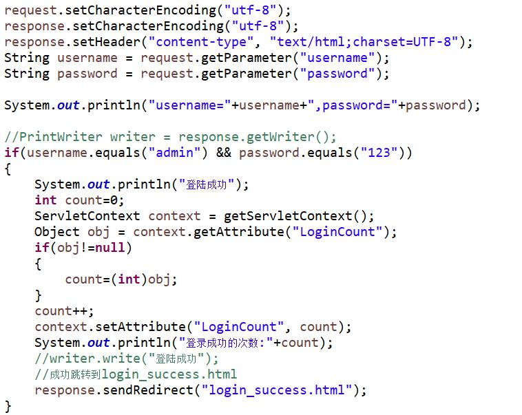
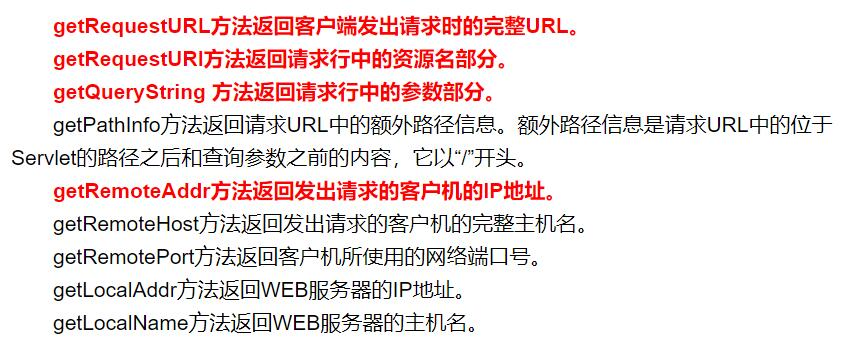
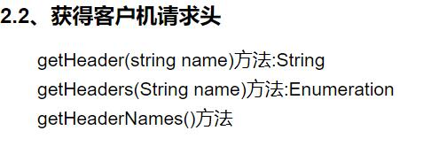
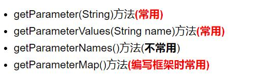
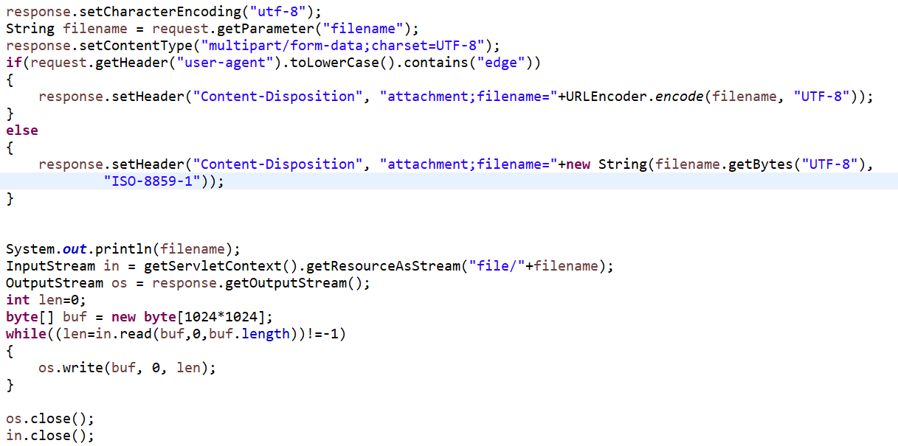

## HttpServletRequest & HttpServletResponse

### 含有通配符的Servlet配置
* 1. 全路径匹配
> 以 / 开始  如 /aa/bb
> localhost:8080/项目名/aa/bb
* 2. 路径匹配，前半段匹配
> 以 / 开始  但是以*结束 如 /a/*/*
>*其实是一个通配符，匹配任意文字
>localhost:8080/项目名/a/aa/bb
* 3. 以扩展名匹配
>*.扩展名  如 *.jsp  *.asp, *.php

### ServletContext 接口
> 每个Web工程只有一个ServletContext对象,不管在那个Servlet中都获取的是同一个对象.

#### 作用
* 可以获取全局的配置参数

获取参数

* 可以获取Web应用中的资源


* 使用ServletContext 存取数据
1. 获取登录数据
2. 记录总数
3. 跳转(重定向)
response.setStatus(302);
response.setHeader("Location","login_success.html")


#### ServletContext的生命周期
* 服务器启动的时候，会为每一个托管的Web程序创建一个ServletContext对象
* 从服务器移除托管的Web程序时或者关闭服务器都会销毁对应的ServletContext对象

* 作用范围:只要在同一个Web应用里面,都可以取到相同的ServletContext对象

### HttpServletRequest 对象




* 解决编码乱码问题:
* GET请求
    1.

         String username = request.getParameter("username");
		 String password = request.getParameter("password");System.out.println("userName="+username+"==password="+password);
		//get请求过来的数据，在url地址栏上就已经经过编码了，所以我们取到的就是乱码，
		//tomcat收到了这批数据，getParameter 默认使用ISO-8859-1去解码
			
		//先让文字回到ISO-8859-1对应的字节数组 ， 然后再按utf-8组拼字符串
		username = new String(username.getBytes("ISO-8859-1") , "UTF-8");
		System.out.println("userName="+username+"==password="+password);
		直接在tomcat里面做配置，以后get请求过来的数据永远都是用UTF-8编码。 
	

    2. 可以在tomcat里面做设置处理 conf/server.xml 加上URIEncoding="utf-8"
 
	     <Connector connectionTimeout="20000" port="8080" protocol="HTTP/1.1" redirectPort="8443" URIEncoding="UTF-8"/>


* 如果是POST方式

		这个说的是设置请求体里面的文字编码。  get方式，用这行，有用吗？ ---> 没用
		request.setCharacterEncoding("UTF-8");
	
		这行设置一定要写在getParameter之前。

#### HttpServletResponse
> 负责返回数据给客户端。 

* 输出数据到页面上


		//以字符流的方式写数据	
		//response.getWriter().write("<h1>hello response...</h1>");
		
		//以字节流的方式写数据 
		response.getOutputStream().write("hello response2222...".getBytes());


#### 响应的数据中有中文，那么有可能出现中文乱码

* 以字符流输出

> response.getWriter()


		//1. 指定输出到客户端的时候，这些文字使用UTF-8编码
		response.setCharacterEncoding("UTF-8");
		
		//2. 直接规定浏览器看这份数据的时候，使用什么编码来看。
		response.setHeader("Content-Type", "text/html; charset=UTF-8");
		
		response.getWriter().write("我爱黑马训练营...");


* 以字节流输出 

> response.getOutputStream()


	
		
		//1. 指定浏览器看这份数据使用的码表
		response.setHeader("Content-Type", "text/html;charset=UTF-8");
		
		//2. 指定输出的中文用的码表
		response.getOutputStream().write("我爱深圳黑马训练营..".getBytes("UTF-8"));


		--------------------------------------------

#### 不管是字节流还是字符流，直接使用一行代码就可以了。

	response.setContentType("text/html;charset=UTF-8");

	然后在写数据即可。


#### 演练下载资源。

1. 直接以超链接的方式下载，不写任何代码。 也能够下载东西下来。 


	让tomcat的默认servlet去提供下载：<br>
	<a href="download/aa.jpg">aa.jpg</a><br>
	<a href="download/bb.txt">bb.txt</a><br>
	<a href="download/cc.rar">cc.rar</a><br>

> 原因是tomcat里面有一个默认的Servlet -- DefaultServlet 。这个DefaultServlet 专门用于处理放在tomcat服务器上的静态资源。



解决不同浏览器下载文件名乱码的问题
```java
	public static String encodeChineseDownloadFileName(HttpServletRequest request, String pFileName)
			throws UnsupportedEncodingException
	{
		String filename = null;
		String agent = request.getHeader("user-agent");
		if (null != agent)
		{
			agent = agent.toLowerCase();
			if (agent.contains("firefox"))
			{// Firefox
				Encoder base64Encoder=java.util.Base64.getEncoder();
				filename = "=?UTF-8?B?" + new String(base64Encoder.encode(pFileName.getBytes("UTF-8"))) + "?=";
			}
			else
			{// IE7+ Chrome
				filename = java.net.URLEncoder.encode(pFileName, "UTF-8");
			}
		}
		else
		{
			filename = pFileName;
		}
		return filename;

	}
```
#### 请求转发与重定向
* 重定向
>早期写法:
>response.setHeader("Location","***.html");
>现在
>response.sendRedirect("***.html");
地址栏上显示的是重定向后资源的路径
*请求转发
>request.getRequestDispatcher("login_failed.html").forward(request, response);
>地址上显示的是请求Servlet的地址。

* 二者的区别
	+ 重定向
		1. 重定向时地址栏上显示的是重定向后资源的路径
		2. 重定向相当于客户端请求了至少两次，第一次请求服务端发回302状态码和定向后的资源文件地址，客户端再根据服务端发回来的资源地址再去请求
		3. 可以跳转到任意路径，不是自己工程下的也可以
		4. 效率稍微低了一些，请求了至少两次
	+ 请求转发
		1. 请求转发地址上显示的是请求Servlet的地址。
		2. 请求转发客户端只请求一次，转发发生在服务器内部
		3. 只能跳转到自己工程下的资源
		4. 效率稍微高一点，只请求了一次