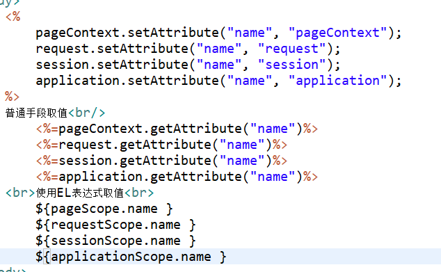
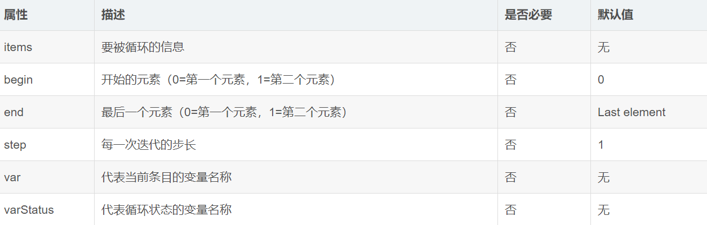

## JSP & EL & JSTL

### JSP(Java Server Page)
>从用户角度看待就是一个网页，从本质来看就是一个Servlet，它会被编译成一个Java类，继承自Servlet

* 为什么会有jsp
> Html 多数情况下用来展示静态内容,一层不变的,但是有时候我们需要在网页上显示一些动态数据，如查询学生信息等,这些动作需要取查询数据库，然后在网页上显示，Html不支持写java代码，jsp可以支持写java代码。现在基本上两种模式，jsp+servlet 或者 Html+Ajax+Servlet。

```
1.<% %>叫做脚本片段，其中写的内容会翻译在Servlet的Service方法中，
显然我们可以在Service方法中定义局部变量或者调用其他方法，
但是不能在Service中再定义其他的方法，
也就是我们可以在<%%>中定义局部变量或者调用方法，但不能定义方法。
在jsp页面可以有多个脚本片段，但是多个脚本片段之间要保证结构完整。

2.<%!%>称作声明，其中写的内容将来会直接翻译在Servlet类中，
因为我们可以在类中定义方法和属性以及全局变量，
所以我们可以在<%!%>中声明方法、属性、全局变量。
3.<%=%>称作jsp表达式，用于将已经声明的变量或者表达式输出到网页上面。

4.直接写在jsp页面<body></body>中的代码称作模板元素，
将来会Servlet的Service方法中的out.write("___")中，作为输出内容。
```
#### jsp配置指令
* page
    ><%@page %> 
    >属性:
    >1.language="java" 表明jsp页面中可以写java代码
    >2.contentType="text/html; charset=UTF-8" 告诉浏览器文件的类型和编码即MIMEType，可以设置的类型在Tomcat下的conf下的Web.xml中可以看到(response.setContentType())
    >pageEncoding="UTF-8" jsp内容编码
    >errorPage=""  设置错误页面
    >isErrorPage="true" 配合errorPage使用
    >extends="" 用于指定jsp翻译成java类后继承的父类，一般不去管它
    >import="" 导包，一般不用手写，快捷键导入
    >buffer="8kb" 设置缓冲区
    >autoFlush 自动刷新
    >session="true"  用于控制在这个jsp界面能否直接使用session对象
* include 静态包含 将other.jsp中的元素拿过来和原来的拼接
    ><%@include file="other.jsp" %> 
    >用于包含另一个页面，使用file属性指定另一个页面的路径
* taglib 引入标签库，使用jstl时使用
    ><%@taglib prefix="" uri="" %> 
    >属性:
    >uri:标签库的路径
    >prefix:标签库的别名

#### jsp动作标签
* include 动态包含指定的页面,直接包含other.jsp编译后的结果
    ><jsp:include page=""></jsp:include> 
* forward
    ><jsp:forward page="other.jsp"></jsp:forward>
    >调到另一个页面,就是一个请求转发，
    >等价于 request.getRequestDispatcher("other.jsp").forward(request,response);
* param 在包含某个页面或者跳转某个页面的时候，加入参数
    ><jsp:forward page="other.jsp">
	>&nbsp;&nbsp;&nbsp;<jsp:param value="beijing" name="address"/>
	</jsp:forward>
    >获取参数
    ><%=request.getParameter("address") %>

#### jsp内置对象
>所谓的内置对象，就是我们可以直接在jsp页面中使用这些对象.不用创建，就可以直接使用

##### 四个作用域对象
* pageContext PageContext，能够存值，还可以获取其他八个内置对象
* request HttpServletRequest
* session       HttpSession
* application   ServletContext
>作用域：表示这些对象可以存值，他们的作用范围有一定的限定
>通过setAttribute 设置值,getAttribute 获取值
>他们作用域的区别:
pageContext 只在当前页面有效
request 一次请求内有效
session 一次会话内有效
application 整个Web工程内有效，服务器关闭后失效


##### 其他内置对象
* out  JspWriter
* response HttpServletResponse
>对于out和response.getWriter() 来说，out的内容会加入response.getWriter()的缓冲区，先输出response.getWriter().write()的内容，再把out输出的内容输出

* exception Throwable 只有在isErrorPage="true"中才可以使用
* page jsp翻译成Servlet类后的实例对象
* config ServletConfig

### EL表达式
>为了简化jsp代码，其实就是为了简化jsp中写的java代码
>格式:${表达式}
EL区分大小写
* 使用EL表达式
    1. 获取四个作用域的值
     
    2. 获取数组中的值
     
    3. 获取List中的值
     
    4. 获取Map中的值
     
    注意:对于Map来说，
    如果键是数值，要键设置为Long类型，使用 `${map[1]}` 获取
    如果键是字符串,使用`${map.key}`或者 `${map["key"]}`
    如果字符串中是aaa.aa 则只能使用 `${map["key"]}`

* 关于EL表达式的取值
    1. 值必须放在域中
    2. 如果不指定域，则先从pageContext中找，找不到再去request，以此类推，再去session，application 去找

* EL表达式中也可以直接使用算术表达式，判断条件
    1. `${1+1 }` 输出2
    2. `${empty user}` 判断user是不是null，是返回true，不是返回false
    3. `${a>b}`  前提 a和 b必须在域中

* EL表达式的11个内置对象
```
pageScope 获取page域属性组成的Map 
requestScope 获取reqeust域属性组成的Map 
sessionScope 获取session域属性组成的Map 
applicationScope 获取application域属性组成的Map 
pageContext 获取jsp的9大隐式对象, 如 ${pageContext.request} 
initParam 获取在web.xml配置的WEB应用参数 
param 请求参数Map<String,String>, 如:${param.userName} 
paramValues 请求参数Map<String,String[]>, 如: ${paramValues.userName[1]} 
header 请求头Map<String,String[]>, 如: ${header[“Accept-Language”] } 
headerValues 请求头Map<String,String[]> 
cookie 获取cookie对象, 如 ${cookie.JSESSIONID.name} ${cookie.JSESSIONID.value}
```
```
EL语法 
常量（直接输出到HTML） 
${“字符串”}，${123}，${true}
变量(在四大域搜寻) 
${userName} 在依次四大域搜寻变量名的值,不存在则返回 “” (相当于 <%= pageContext.findAttribute(“userName”) %>) 
①${pageScope.userName} 
②${requestScope.userName} 
③${sessionScope.userName} 
④${applicationScope.userName}
搜寻数组/集合对象 
${myList[0]}
搜寻map对象 
${myMap.key} 如存在键值对bread和价格，${price.bread}就得到价格 
${myMap[“key-first.last”]} key名是数字或特殊符(.-),必须用[]
搜寻javaBean对象 
${user.getName()} 相当于 <%=user.getName()%> 
${user.name} 
${user[“name”] 
不能这样写：${user[name]}

简单运算 
算术运算（+、-、*、/、%） 
①除法不是整除 
②“+”不能拼接，只能做加法 
③如果字符串可以转化成数字则可以做运算 
④两端空格不影响，但是在数字字符串之间有空格则报错
关系运算（>、<、>=、<=、==、!=）
逻辑运算（&&、||、!）
三元表达式 
${3==3 ? “Y” : “N”} 
El表达式不能嵌套，当比较的部分是从之前传过来值时，要想别的办法
域中指定的属性是否空（empt、not empty） 
${empty person.name}，${not empty person.name} 
empty运算在以下四种情况下，返回true 
根据绑定名未找到绑定值
绑定值是 “”
绑定值是null
集合的长度为0
```

### JSTL
> 全称 ： JSP Standard Tag Library  jsp标准标签库

> 简化jsp的代码编写。 替换 <%%> 写法。 一般与EL表达式配合


#### 怎么使用
1. 在jsp页面上，使用taglib 指令，来引入标签库

2. 注意： 如果想支持 EL表达式，那么引入的标签库必须选择1.1以上的版本，1.0的版本不支持EL表达式。

>一般使用JSTL1.1以上版本,现在最新版是JSTL1.2.5 
在Apache Tomcat官网下载JSTL标签库(Taglibs) 
下载地址: http://tomcat.apache.org/download-taglibs.cgi 
下载页面有4个jar包: 
     Impl:    taglibs-standard-impl-1.2.5.jar JSTL实现类库 
    Spec:    taglibs-standard-spec-1.2.5.jar JSTL标准接口 
    EL:    taglibs-standard-jstlel-1.2.5.jar JSTL1.0标签-EL相关 
    Compat:    taglibs-standard-compat-1.2.5.jar 兼容版本 
从README得知: 
如果不使用JSTL1.0标签,可以忽略taglibs-standard-jstlel 包, 
README没有介绍taglibs-standard-compat包,估计应该是兼容以前版本标签库, 
所以一般只需要 taglibs-standard-impl 和 taglibs-standard-spec 两个jar包

#### 核心标签库
>core 核心标签库 
fmt 国际化标签
sql 数据库标签(废弃)
xml XML标签(废弃) 
在jsp中引入 core fmt 标签库: 
<%@ taglib uri = “http://java.sun.com/jsp/jstl/core” prefix= “c”%> 
<%@ taglib uri = “http://java.sun.com/jsp/jstl/fmt” prefix = “f”%>
#### 常用标签
* <c:if>

        <!--name取自转发前的request-->
        <c:if test="${name == 'jack'}" var="name1" scope="page">
            name is jack!
        </c:if>
        <br/>
        <!--name1存储上面test的结果，是true或者false，可以用EL表达式继续取值-->
        <!--若是var是name，那么实际上是重新赋值，name不是jack而是true-->
        <c:if test="${name1 != 'jack'}" var="name" scope="page">
            name1 is not jack!
        </c:if>
        <!--此处没有else标签-->


* <c:choose>、<c:when>、<c:otherwise> 

        用这个可能比<c:if>要好一些
        <c:set var="salary" scope="session" value="${2000*2}"/>
        <c:choose>
            <c:when test="${salary == 4000}">
                true,your salary is ${salary}
            </c:when>
            <c:otherwise>
                false,your salary is ${salary}
            </c:otherwise>
        </c:choose>
* c:foreach
 
>varStatus的属性 
current：当前这次迭代的（集合中的）项 
index：当前这次迭代从 0 开始的迭代计数（第几个） 
count：当前这次迭代从 1 开始的迭代计数（第几个） 
first：用来表明当前这轮迭代是否为第一次迭代的标志，返回true/false 
last：用来表明当前这轮迭代是否为最后一次迭代的标志,返回true/false

        <!--循环列表-->
        <c:forEach items="${list}" var="it"  varStatus="st">
            ${it}----迭代变量，表示list中每一项，等价于${st.current}
            ${st.index}----当前索引
        </c:forEach>

        <!--循环Map-->
        <c:forEach items="${map}" var="it" varStatus="st">
            ${it.key}：${it.value}
            ${st.current}--格式为：key=value
        </c:forEach>

        <!--循环计数，类似for循环-->
        <c:forEach var="i" begin="1" end="10" step="2" varStatus="st">
            ${i}
        </c:forEach>  
* <c:forTokens> 
标签与标签有相似的属性，不过还有另一个属性：  

        
        <!--把字符串按分隔符分开成数组，result代表数组的每一项-->
        <c:forTokens items="sdfa,fsad,fds" delims="," var="result">
            ${result}<br>
        </c:forTokens>
* c:set

		<!-- 声明一个对象name， 对象的值 zhangsan , 存储到了page（默认） ， 指定是session -->
		<c:set var="name" value="zhangsan" scope="session"></c:set>
		
		${sessionScope.name }

* fmt标签库 
><f:formatDate>属性 
<f:formatNumber>属性

        <!--格式化日期-->
        <!--var属性是必须的-->
        <f:formatDate value="<%=new Date()%>" pattern="yyyy年MM月dd日 HH:mm:ss" var="date" scope="request" />
        <!--上面是转换日期到字符串，并存储在date变量中，要用还得EL取-->
        ${requestScope.date}
        <!--格式化数字-->
        <!--这里var不是必须的，没有则直接显示值，有则不显示，把值存在var变量中-->
        <f:formatNumber type="percent"  minFractionDigits="10" value="${balance}"/>
