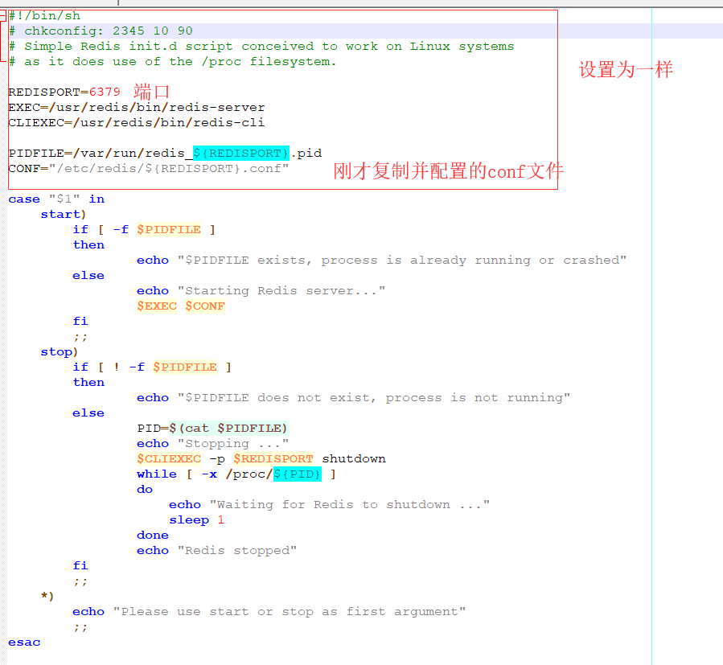

## radis 简介
1. radis 支持的键值数据类型
    >字符串类型 String
    >散列类型(Hash) Hash
    >列表类型 List
    >集合类型 Set
    >有序集合类型 SortedSet

2. 应用场景
    >缓存(数据查询，短链接，新闻内容，商品内容等等)
    >聊天室的在线好友列表
    >任务队列(秒杀、抢购、12306等等)
    >应用排行榜
    >网站访问统计
    >数据过期处理(可以精确到毫秒)
    >分布式集群框架中的session分类

## redis的安装
1. redis是以源码提供的
2. 官方下载源码 http://www.redis.cn/download.html
3. 移动到 /usr/redis 下
4. 解压 tar -vxzf redis-4.0.9.tar.gz
5. 进入 cd /usr/redis/redis-4.0.9
6. make PREFIX=/usr/redis install 进行安装
7. 安装后/usr/redis/ 下出现了bin目录，即为安装成功
8. 进入bin目录
9. ./redis-server 即可以启动redis
## 配置redis 开机自启动
1. 复制配置文件到 cp /usr/redis/redis-4.0.9/redis.conf  /etc/redis/6379.conf
2. cd /etc/redis/
3. chmod 777 6379.conf
4. vim 6379.conf  修改以下项
    1. 注释掉 bind 127.0.0.1 ，即在这一句前加上# ，表示允许所有的远程主机访问
    2. 设置  daemonize yes  表示允许服务在后台运行
5. 复制启动脚本到 cp /usr/redis/redis-4.0.9/src/utils/redis_init_script /etc/rc.d/init.d/redis,并修改为一下配置
    
6. 权限设置 chmod 777 /etc/rc.d/init.d/redis 

7.  chkconfig redisd on 

9. 测试启动，关闭 
    1. service redisd start  开启服务
    2. service redisd stop 关闭服务
10. 如果关闭服务出现 xxxxxx /var/run/ xxxxx redis_6379.pid xxxxx
    只要前面设置没问题，直接重启就ok
### 开启关闭服务

