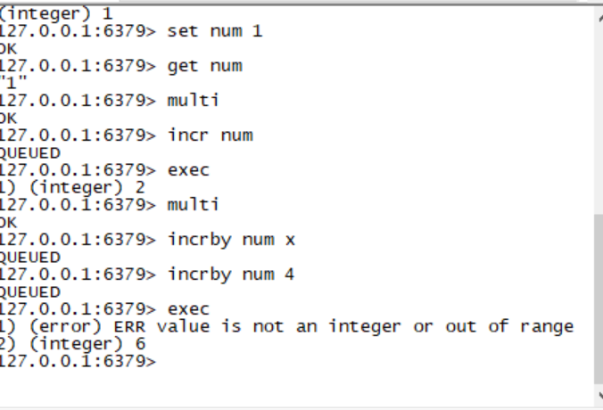

### Radis的数据库
1. 一个radis支持16个仓库0-15 ,默认连接0号仓库
    >select n 选择仓库
2. 将 i 号仓库的name 移动到j号仓库
    >move name j 
3. ping 测试数据库是否存活

4. echo 输出

5. quit 退出连接

### 增删改查 
1. 连接客户端 redis-cli

2. set key value  增加|修改 键值对

3. del key     删除键值对

4. key *   查询所有键

5. dbsize 返回当前数据库的key的数目

6. info 获取服务器的信息和统计

7. flushdb 删除数据库下的所有key

8. flushall 输出所有数据库下的key

9. multi 开启事务

10. exec 提交事务

11. discard 回滚事务

12. incr key  为key的数字value类型的值加1

13. incrby key num  为key的数字value类型的值加num


### 消息订阅与发布  类似多播，发布订阅模式
1. 订阅频道 subscribe channel 订阅频道
    >subscribe mychat 订阅mychat频道
2. psubscribe channel* 批量订阅频道
    >psubscribe s* 订阅以s开头的频道
3. publish channel content 在指定的频道发言 
    > publish mychat 'mychat' 在mychat频道发布 'mychat'

### 事务
* 和其他数据库一样，redis同样提供了事务机制，通过MULTI/exec/DISCARD 三个命令实现事务

* 特征
    1. redis 的事务隔离级别是串行化，事务执行期间，redis不会再为其他客户端的请求提供任何服务，从而保证了事务中所有命令被原子的执行。

    2. 和关系型数据库相比,在redis事务中如果有一条命令执行失败，其后的命令仍然会被继续执行。

    3. 我们可以通过MULTI 命令开启一个事务，在该语句之后执行的命令都被视为事务之内的操作，最后我们可以通过exec/discard 来提交/回滚事务。

    4. 事务开启之前，如果客户端与服务器之间出现通讯故障并导致网络断开，其后所有待执行的语句都不会被服务器执行。然而如果网络中断之间是发生在客户端执行exec命令之后，那么该事务中的所有命令都会被执行。

    5. 当使用 Append-Only模式时，redis会通过调用系统函数write将该事务内的所有的写操作在本次调用中全部写入磁盘。然而如果在写入的过程中出现系统崩溃，如电源故障导致的宕机，那么此时也许只有部分数据被写入到磁盘，而另外一部分数据已经丢失。redis服务器会在重新启动时执行一系列必要的一致性检测，一旦发现类似问题，就会立即腿粗，并给出相应的错误提示。此时，我们要充分的利用redis工具包内提供的redis-check-aof工具，该工具可以帮助我们定位到数据不一致的错误，并将已经写入的部分数据进行回滚。修复之后我们就可以再次启动redis服务器了

    

### redis 的持久化
1. redis的高性能是由于其将所有的数据都存储到内存中，为了使redis在重启之后仍能保证数据不丢失，需要将数据从内存中同步到硬盘中，这一过程就是持久化。

2. redis支持两种 方式的持久化，一种是RDB方式，一种的AOF方式。可以单独使用其中的一种或者将二者结合使用

3. RDB持久化(默认支持，无需配置)，该机制是指在指定的时间间隔内将内存中的数据集快照写入磁盘。

4. AOF持久化，该机制将以日志的形式记录服务器所处理的每一个写操作，在redis服务器启动之初会读取该文件来重新构建数据库，以保证启动后数据库中的数据是完整的。

5. 无持久化，我们可以通过配置方式禁用redis服务器的持久化功能，这样我们就可以将redis视为一个功能加强版的memcached了

### RDB的优势
    1. 一旦使用该方式，整个redis数据库将只包含一个文件，这对于文件备份而言是非常完美的。比如，你可能打算每个小时归档一次最近24小时的数据，同时每天还要归档一次最近30天的数据，通过这样的数据备份策略，一旦系统出现灾难性的故障,可以非常容易地进行恢复。

    2. 对于灾难恢复而言，RDB是非常不错的选择。因为我们可以非常轻松的将每一个单独的文件压缩后在转移到其他的存储介质上。

    3. 性能最大化，对于redis的服务进程而言，在开始持久化是，他唯一需要做的只是fork出子进程，之后再由子进程完成这些持久化的工作，这样就可以极大的避免服务进程执行IO操作了。

    4. 相比于AOF机制,如果数据集很大，RDB的启动效率会更高。

### RDB 劣势
    1. 如果你想保持数据的高可用性，即最大限度的避免数据丢失，那么rdb将不是一个很好的选择，因为系统一旦在定时持久化之前出现宕机现象，此前没有来得及写入磁盘的数据都将丢失。

    2. 由于rdb是通过fork子进程来协助完成数据持久化工作的，因此当数据集较大时，坑内会导致整个服务器停止服务几百毫秒，甚至是1秒钟

### RDB的配置参数说明
     1. 快照参数设置
        1. save 900 1 #每900秒至少有1个key发生变化，则dump内存快照

        2. save 300 10 #每300秒至少有10个key发生变化，则dump内存快照

        3. save 60 10000 #每60秒至少有10000个key发生变化，则dump内存快照

### AOF优势
1. 该机制可以带来更高的数据安全性，即数据持久化，。redis中提供了三种同步策略，即每秒同步，每修改同步和不同步。事实上，每秒同步也是异步完成的，其效率也是非常高的，所差的是一旦系统出现宕机现象，那么这一秒钟之内修改的数据将会丢失。而没修改同步，我们可以将其视为同步持久化，即每次发生的数据变化都会被立即记录到磁盘中。可以预见，这种方式在效率上是最低的。无同步效率最高，但数据安全性最差。

2. 由于该机制对日志文件的写入操作采用的是append模式，因此写入过程中即使出现宕机现象，也不会破坏日志文件中已经存在的内容。然而，如果我们本次操作只写入了一半的数据就出现了系统崩溃的问题，不用担心，redis下一次启动之前，我们可以通过redis-check-aof工具来帮助我们解决数据一致性的问题。

3. 如果日志过大，redis可以自动启用rewrite机制。即redis以append模式不断地将修改数据写入到老的磁盘文件中，同时redis还会创建一个新的文件用于记录此期间有哪些修改命令被执行。因此在进行rewirite切换时可以更好的保证数据安全性。

4. AOF包含一个格式清晰，易于理解的日志文件用以记录所有的修改操作。事实上，我们也可以通过该文件完成数据的重建。

### AOF劣势
1. 对于相同数量的数据集而言，AOF文件通常大于RDB文件

2. 根据同步策略的不同，AOF在运行效率上往往会慢于RDB。总之，每秒同步策略的效率是比较高的，同步禁用策略的效率和RDB一样高效。

### 配置AOF
1. appendfsync always  # 每次有数据发生修改时都会写入AOF文件

2. appendfsync everysec #每秒钟同步一次，该策略为AOF的缺省策略

3. appendfsync no   #从不同不，高效但是数据不会被持久化

4. 重写AOF，若不满足重写条件是，可以手动重写，命令:bgrewritedaof


### 使用客户端连接redis
1. 导入jar commons-pool2-2.5.0.jar 和 jedis-2.9.0.jar 

2. 编写配置文件
>host=127.0.0.1
port=6379

3. JedisUtils
```java
package com.ph.store_v4.utils;

import java.io.IOException;
import java.io.InputStream;
import java.util.Properties;

import redis.clients.jedis.Jedis;
import redis.clients.jedis.JedisPool;
import redis.clients.jedis.JedisPoolConfig;

public class JedisUtils
{
	// 创建连接池
	private static JedisPoolConfig config;
	private static JedisPool pool;

	static
	{
		config = new JedisPoolConfig();
		config.setMaxTotal(30);
		config.setMaxIdle(2);
		InputStream in = JedisUtils.class.getClassLoader().getResourceAsStream("jedis-conf.properties");
		Properties prop = new Properties();
		try
		{
			prop.load(in);
			String host = prop.getProperty("host");
			int port = Integer.valueOf(prop.getProperty("port"));
			pool = new JedisPool(config, host, port);
		}
		catch (IOException e)
		{
			// TODO Auto-generated catch block
			e.printStackTrace();
		}
		finally
		{
			if (in != null)
			{
				try
				{
					in.close();
				}
				catch (IOException e)
				{
					// TODO Auto-generated catch block
					e.printStackTrace();
				}
			}
		}

	}

	// 获取连接的方法
	public static Jedis getJedis()
	{
		return pool.getResource();
	}

	// 释放连接
	public static void closeJedis(Jedis j)
	{
		j.close();
	}
}


```
